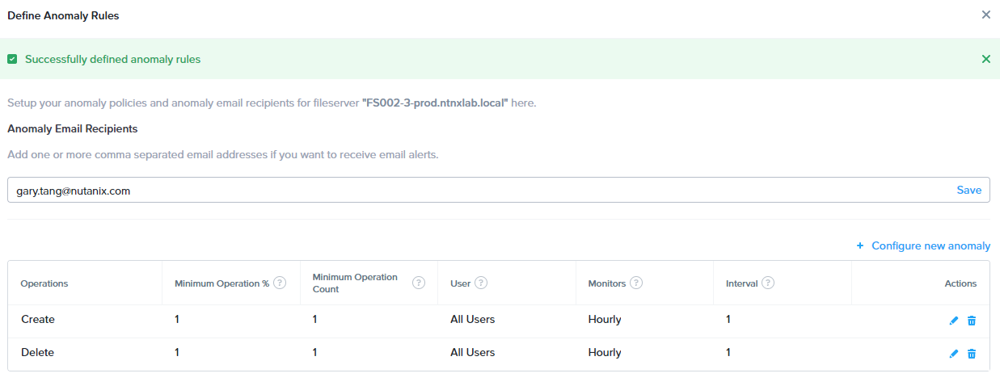
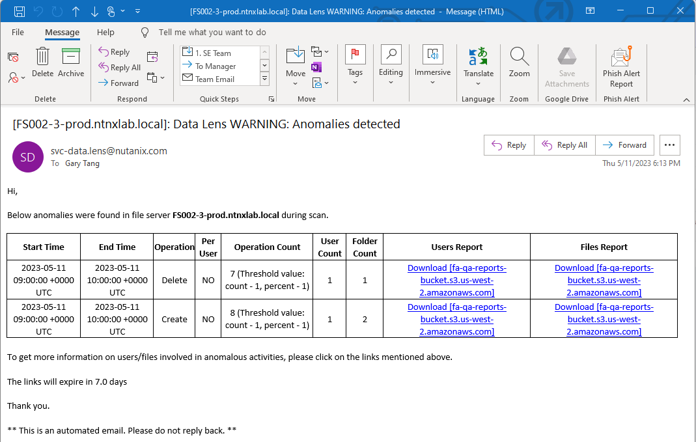

# Data Lens - Anomaly Detection
## Overview

One of the major features that Data Lens have is the ability to identify abnormal behavior. It gives administrators a way to monitor analytics data for potential threats such as mass file deletion or perimission changes. When anomalies are detected based on administrator defined policies, alerts are sent to warn the administrator of the threat.

In this exercise you will create anomaly rules and trigger events against the rules.

## Login to Data Lens (if you are not already there)

1. Connect to corp VPN, select the gateway without **(ST)**
   
2. Go to https://datalens-qa.nutanix.com/ 
   
3. Your instructor will give you a my portal account to login
   
4. Choose **Common Tenant** and then **Proceed**.
   
      

5. In the **Data Lens Global Dashboard**, go to **File Servers** and search the FQDN of your File Server Name(**FSxyz-a-prod**).

      

    !!!note 
           Your File Server is already added and enabled to the Data Lens Dashboard. Contact lab instructor if you cannot find it.

6. Click the File Server Name to enter the Dashboard.

## Define Anomaly Rules

1.  Click on :fontawesome-solid-bars: > **Anomalies**

2.  Click **Define Anomaly Rules**

3.  Add your email address to the **Anomaly Email Recipients**, then click **Save**

4.  Click + Define Anomaly Rules, then create the first rule with the following settings:
    - Operations: **Delete**
    - Minimum Operation %: **1**
    - Minimum Operation Count: **1**
    - User: **All Users**
    - Monitors: **Hourly**
    - Interval: **1**
5.  Click  to save the rule

6.  Click **+ Configure new anomaly** and create a second rule with the following settings:
    - Operations: **Create**
    - Minimum Operation %: **1**
    - Minimum Operation Count: **1**
    - User: **All Users**
    - Monitors: **Hourly**
    - Interval: **1**

7.  Click  to save the rule

8.  Click **Close** to go back to the dashboard
        

9.  From the dashboard you are able to see number of anomaly alerts. top users and top folders that trigger anomaly rules on the past period.

## Trigger anomaly rules

1.  While waiting for the Anomaly Alerts to populate we'll create a permission denial.

2.  Create a new directory called **RO** in the Marketing share

3.  Create 2 text files in the **RO** directory with some text like "hello world" called **myfile01.txt** & **myfile02.txt**

4.  Delete the 2 files. The creation and deletion of files should trigger the anomaly rules.

5. Continue on the next lab until you receive email warning about anomalies detected. 
        

6.  Go back to Data Lens Anomaly Detection dashboard and check the charts.
        

