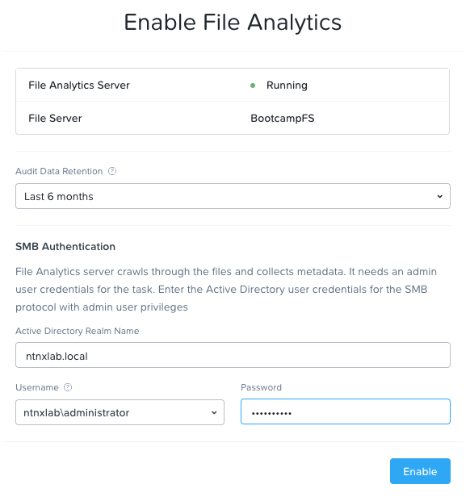
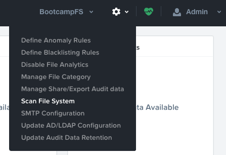
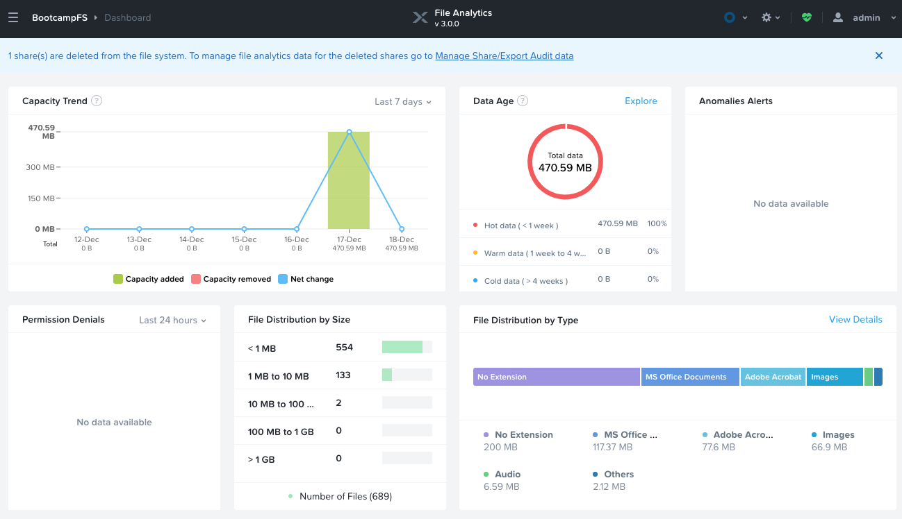
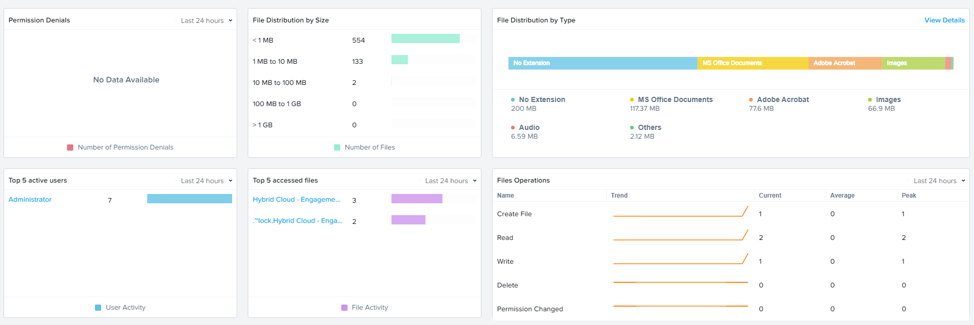

# File Analytics: File System Scan {#file_analytics_scan}

## Overview

## File Analytics Scan

1.  In **Prism** \> **File Server** \> select your BootcampFS files
    server

2.  Click **File Analytics**

    

3.  If an option appears to enable Files Analytics appears, enter your
    AD details as shown below and click on **Enable**

    -   **Active Directory Realm Name** - ntnxlab.local
    -   **Username** - <administrator@ntnxlab.local>
    -   **Password** - nutanix/4u

    

4.  Analytics will perform an initial scan of the existing shares which
    will take just a couple minutes. You can see the scan by going to
    the `cog`{.interpreted-text role="fa"} icon within the Analytics UI
    and selecting **Scan File System**

    

5.  Choose **Cancel** to exit the scan details window

6.  After viewing the scan details, refresh your browser. You should see
    the **Data Age**, **File Distribution by Size** and **File
    Distribution by Type** dashboard panels update.

    

7.  Create some audit trail activity by going to the marketing share and
    opening one of the word files under **Sample Data** \> **Documents**

    ::: note
    ::: title
    Note
    :::

    You may need to complete a short wizard for OpenOffice if using that
    application to open a file.
    :::

8.  Refresh the **Dashboard** page in your browser to see the **Top 5
    active users**, **Top 5 accessed files** and **File Operations**
    panels update

    

9.  Click on your user under **Top 5 active users**. This will take you
    to the audit trail of the user.

10. You can also click on the `bars`{.interpreted-text role="fa"} \>
    **Audit Trails** menu and search for either your user or a given
    file. You can use wildcards for your search, for example **.doc**

    

## Takeaways

What are the key things you should know about **Nutanix File
Analytics**?

-   File Analytics helps you better understand how data is utilized by
    your organizations to help you meet your data auditing, data access
    minimization and compliance requirements.
