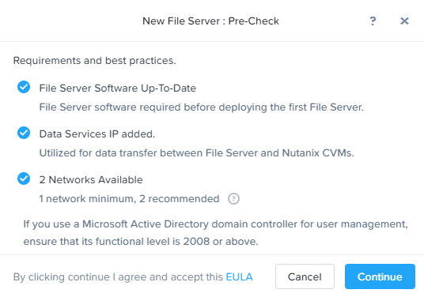
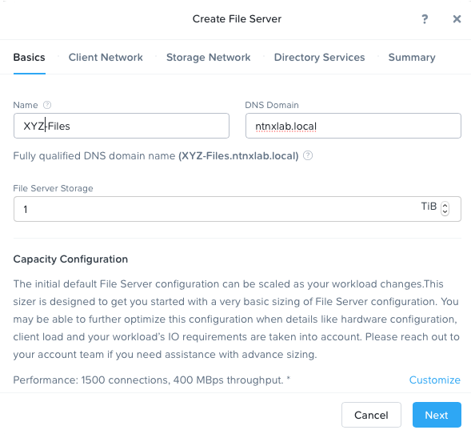
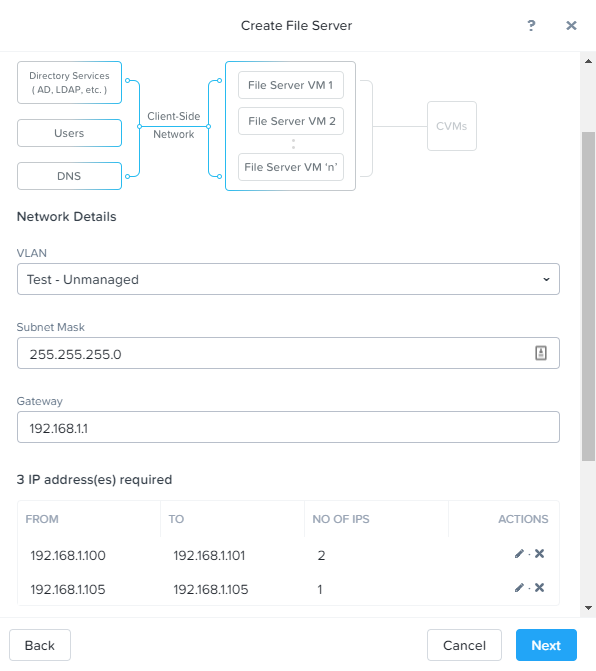
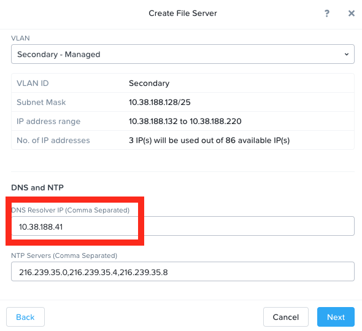
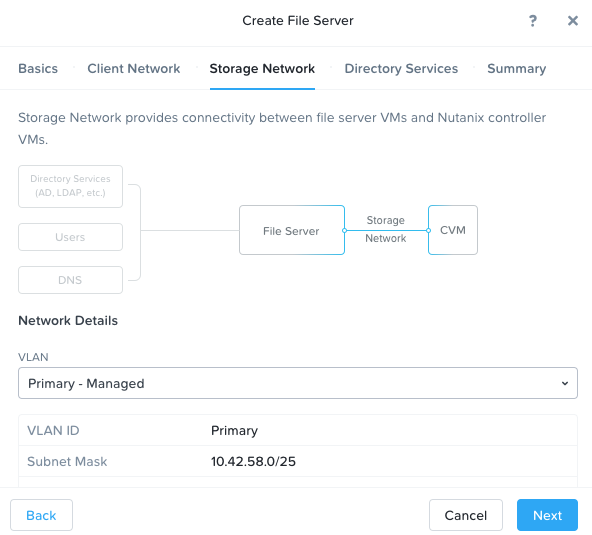
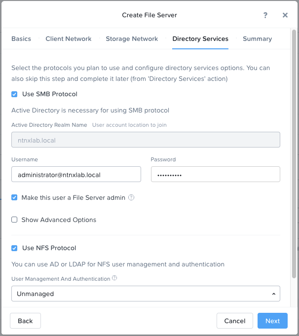
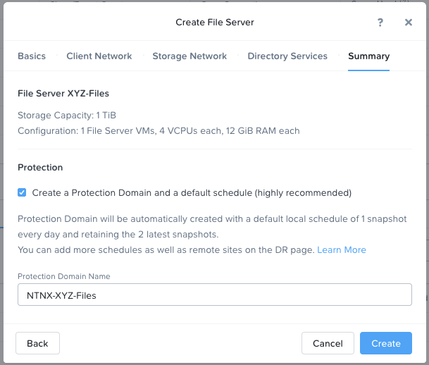

::: {#files_deploy}
::: title
Nutanix Files Deploy
:::
:::

# Files: Deploy

## Deploy Files {#deploying_files}

1.  In **Prism \> File Server**, click **+ File Server** to open the
    **New File Server Pre-Check** dialogue.

    

    For the purpose of saving time, the Files has already been uploaded
    to your cluster. Files binaries can be downloaded directly through
    Prism Element \> `cog`{.interpreted-text role="fa"} \> Upgrade
    Software menu (option to uploaded manually is present as well).

    

    Additionally, the cluster\'s **Data Services** IP Address has
    already been configured (*10.XX.YY.38*). In a Files cluster, storage
    is presented to the Files VMs as a Volume Group via iSCSI, hence the
    dependency on the Data Services IP.

    ::: note
    ::: title
    Note
    :::

    If staging your own environment, the Data Services IP can be easily
    configured by selecting `gear`{.interpreted-text role="fa"} **\>
    Cluster Details**, specifying the **iSCSI Data Services IP**, and
    clicking **Save**. Currently, the Data Services IP must be in the
    same subnet as your CVMs.
    :::

    Lastly Files will ensure that at least 1 network has been configured
    on the cluster. A minimum of 2 networks are recommended to have
    segmentation between the client side and storage side networks.

2.  Click **Continue** on Pre-Check window if it appears

    

3.  Fill out the following fields:

    -   **Name** - *initials*-Files (e.g. XYZ-Files)
    -   **Domain** - ntnxlab.local
    -   **File Server Size** - 1 TiB

    

4.  Click **Next**.

5.  Select the **Secondary - Managed** VLAN for the **Client Network**.

    ::: note
    ::: title
    Note
    :::

    If you are using a Single Node HPOC, use the **Primary - Managed**
    VLAN for the **Client Network**.
    :::

    Each Files VM will consume a single IP on the client network.

    ::: note
    ::: title
    Note
    :::

    In the HPOC environment it is critical to use the secondary VLAN for
    the client network if using separate client and storage networks.

    It is typically desirable in production environments to deploy Files
    with dedicated virtual networks for client and storage traffic. When
    using two networks, Files will, by design, disallow client traffic
    the storage network, meaning VMs assigned to the primary network
    will be unable to access shares.
    :::

    ::: note
    ::: title
    Note
    :::

    As this is an AHV managed network, configuration of individual IPs
    is not necessary. In an ESXi environment, or using an unmanaged AHV
    network, you would specify the network details and available IPs as
    shown below.

    
    :::

6.  Specify your cluster\'s **Domain Controller** VM IP (look for
    **AutoAD** VM IP address in Prism Element) as the **DNS Resolver
    IP** (e.g. 10.XX.YY.41)). Leave the default (cluster) NTP Server.

    ```{=html}
    <strong><font color="red">In order for the Files cluster to successfully find and join the NTNXLAB.local domain it is critical that the DNS Resolver IP is set to the Domain Controller VM IP FOR YOUR CLUSTER. By default, this field is set to the primary Name Server IP configured for the Nutanix cluster, this value is incorrect and will not work.</font></strong>
    ```
    

7.  Click **Next**.

8.  Select the **Primary - Managed** VLAN for the Storage Network.

    Each Files VM will consume a single IP on the storage network, plus
    1 additional IP for the cluster.

    

9.  Click **Next**.

10. Fill out the following fields:

    -   Select **Use SMB Protocol**
    -   **Username** - <administrator@ntnxlab.local>
    -   **Password** - nutanix/4u
    -   Select **Make this user a File Server admin**
    -   Select **Use NFS Protocol**
    -   **User Management and Authentication** - Unmanaged
    -   Select **Show NFS Advanced Options**
    -   **NFS protocol version** - Enable NFSv4 by default for all
        exports

    

    

    ::: note
    ::: title
    Note
    :::

    In unmanaged mode, users are only identified by UID/GID. In Files
    3.5, Files supports both NFSv3 and NFSv4
    :::

11. Click **Next**.

    By default, Files will automatically create a Protection Domain to
    take daily snapshots of the Files cluster and retain the previous 2
    snapshots. After deployment, the snapshot schedule can be modified
    and remote replication sites can be defined.

    

12. Click **Create** to begin the Files deployment.

13. Monitor deployment progress in **Prism \> Tasks**.

    Deployment should take approximately 10 minutes.

    

    ::: note
    ::: title
    Note
    :::

    If you accidentally did not configure Files to use the Active Directory domain controller (AutoAD or customer-provided) as the DNS server, after deploying the File Server you will get the following errors.

    :   -   DNS \'NS\' records not found for *domain*
        -   Failed to lookup IP address of *domain*. Please verify the
            domain name, DNS configuration and network connectivity.

    This can easily be corrected after deployment, without having to delete and redeploy the Files Server.

    :   -   Within the **File Server** dropdown, select the file server
            you deployed, and click **Update \> Network Configuration**.
            Modify the entry for *DNS Resolver IP*, and click **Next \>
            Save**.
        -   Click **DNS**. Update this page with the AutoAD FQDN
            **dc.ntnxlab.local** (or customer-provided), Username and
            Password of an Active Directory user with administrator
            privileges, and click **Submit**.
    :::

14. Go to **Prism \> File Server** and select the *Initials***-Files**
    server and click **Protect**.

    

15. Observe the default Self Service Restore schedules, this feature
    controls the snapshot schedule for Windows\' Previous Versions
    functionality. Supporting Previous Versions allows end users to roll
    back changes to files without engaging storage or backup
    administrators. Note these local snapshots do not protect the file
    server cluster from local failures and that replication of the
    entire file server cluster can be performed to remote Nutanix
    clusters. Click **Close**.

    

## Takeaways

What are the key things you should know about **Nutanix Files**?

-   Files can be rapidly deployed on top of existing Nutanix clusters,
    providing SMB and NFS storage for user shares, home directories,
    departmental shares, applications, and any other general purpose
    file storage needs.
-   Files is not a point solution. VM, File, Block, and Object storage
    can all be delivered by the same platform using the same management
    tools, reducing complexity and management silos.
