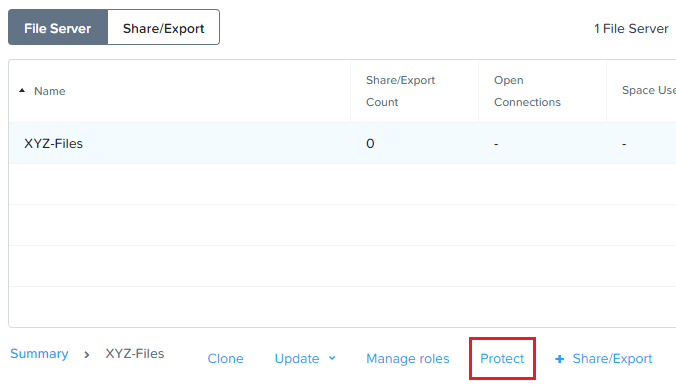

# Files: Deploy

## Deploy Files

In this section, we will be creating a Single Node File Server that will be used for File replication lab.

1.  In **Prism Element > File Server**, click **+ File Server** to open the
    **Create File Server** dialogue.

    !!!note

           As we have already deployed a file server in this cluster, it will use the current FS version to deploy a new file server. In a normal deployment, if this is the first file server, you will need to go through a pre-check and select the Files version from a list of available compatible versions. You can also choose to manually upload a File version to start the deployment.

2.  Fill out the following fields:

    -   FS*XYZ*-*A*-dr (e.g. FS002-3-dr)
    -   **Domain** - ntnxlab.local
    -   **File Server Size** - 1 TiB

    

3.  Click **Next**.

5.  Select the **Primary - Managed** VLAN for the **Client Network**.
    
    Each Files VM will consume a single IP on the client network.

    !!!note
    
           It is typically desirable in production environments to deploy Files with dedicated virtual networks for client and storage traffic. When using two networks, Files will, by design, disallow client traffic in the storage network, meaning VMs assigned to the primary network will be unable to access shares.

   
    ???info "Check here for ESXi Hypervisor information"
           As this is an AHV managed network, configuration of individual IPs
           is not necessary. In an ESXi environment, or using an un-managed AHV
           network, you would specify the network details and available IPs as
           shown below.
       
           
    

6.  Specify your cluster's **Domain Controller** VM IP (look for
    **AutoAD** VM IP address in Prism Element) as the **DNS Resolver
    IP** (e.g. 10.XX.YY.41)). Leave the default (cluster) NTP Server.

    !!!danger
             In order for the Files cluster to successfully find and join the NTNXLAB.local domain it is critical that the DNS Resolver IP is set to the Domain Controller VM IP FOR YOUR CLUSTER. By default, this field is set to the primary Name Server IP configured for the Nutanix cluster, this value is incorrect and will not work.

             

7.  Click **Next**.

8.  Select the **Primary - Managed** VLAN for the Storage Network.

    Each Files VM will consume a single IP on the storage network, plus one additional IP for the cluster.

    

9.  Click **Next**.

10. Fill out the following fields:

    -   Select **Use SMB Protocol**
    -   **Username** - <administrator@ntnxlab.local>
    -   **Password** - nutanix/4u
    -   Select **Make this user a File Server admin**
    -   Select **Use NFS Protocol**
    -   **User Management and Authentication** - Unmanaged
    -   Select **Show NFS Advanced Options**
    -   For 4-node HPOC only: **NFS protocol version** - Enable NFSv4 by default for all
        exports

    

    

    !!!info

            In un-managed mode, users are only identified by UID/GID. Starting from Files 3.5, Files supports both NFSv3 and NFSv4.

11. Click **Next**.

    By default, FILES will automatically create a Protection Domain to
    take daily snapshots of the Files cluster and retain the previous 2
    snapshots. After deployment, the snapshot schedule can be modified
    and remote replication sites can be defined.

    

12. Click **Create** to begin the Files deployment.

13. Monitor deployment progress in **Prism > Tasks**.

    Deployment should take approximately 10 minutes. 

    !!!note
            You should start working on the next lab while the File Server is creating.

    

    ???tip "Having trouble with File Server not joining Active Directory?"

          If you accidentally did not configure Files to use the Active Directory domain controller (AutoAD or customer-provided) as the DNS server, after deploying the File Server you will get the following errors.
      
          -   DNS 'NS' records not found for *domain*
          -   Failed to lookup IP address of *domain*. Please verify the
              domain name, DNS configuration and network connectivity.
      
          This can easily be corrected after deployment, without having to delete and redeploy the Files Server.
      
          -   **Launch File Console**, go to **Configuration > Authentication > Directory Services**
          -   Click **Use SMB Protocol**, put **ntnxlab.local** in Active Directory Realm Name
          -   Put administrator@ntnxlab.local and nutanix/4u as username and password
          -   Select **Make this user a File Server admin**
          
    

14. Go to **Prism > File Server** and select the *Initials***-Files**
    server and click **Protect**.

    

15. Observe the default Self Service Restore schedules, this feature
    controls the snapshot schedule for Windows\' Previous Versions
    functionality. Supporting Previous Versions allows end users to roll
    back changes to files without engaging storage or backup
    administrators. Note these local snapshots do not protect the file
    server cluster from local failures and that replication of the
    entire file server cluster can be performed to remote Nutanix
    clusters. Click **Close**.

    

## Takeaways

What are the key things you should know about **Nutanix Files**?

-   Files can be rapidly deployed on top of existing Nutanix clusters,
    providing SMB and NFS storage for user shares, home directories,
    departmental shares, applications, and any other general purpose
    file storage needs.
-   Files is not a point solution. VM, File, Block, and Object storage
    can all be delivered by the same platform using the same management
    tools, reducing complexity and management silos.
