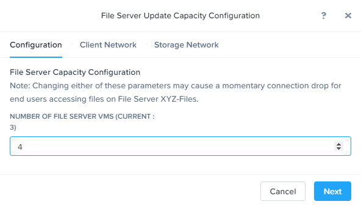
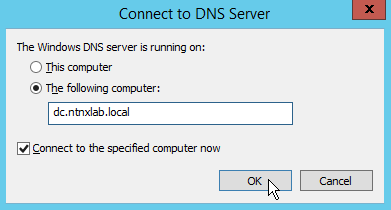
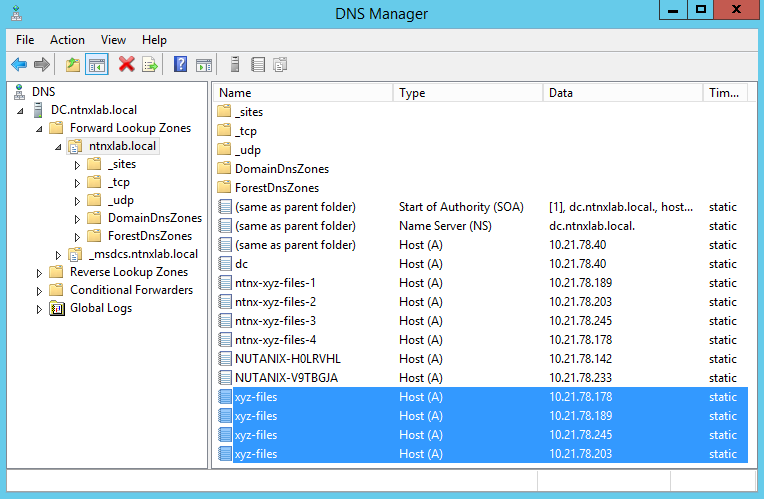

# Files: Expand Cluster

## Overview

!!!info

       This lab can only be done on a HPOC with more than 1 node. Single Node
       HPOC clusters cannot be used to run this lab.
       
       Note that the number of Files Server VMs is limited to number of
       physical nodes in a Nutanix cluster. Most HPOCs will have 3 to 4 nodes.
       
       At the time of Files Server 4.0.0.2 release, a Files Server with just 1
       FSVM cannot be scaled out.
       

Files offers the ability to scale up and scale out a deployment. Scaling
up the CPU and memory of Files VMs allows an environment to support
higher storage throughput and number of concurrent sessions. Currently,
Files VMs can be scaled up to a maximum of 12 vCPU and 96GB of RAM each.

The true power of Files scalability is the ability to simply add more
Files VMs, scaling out much like the underlying Nutanix distributed
storage fabric. An individual Files cluster can scale out up to the
number of physical nodes in the Nutanix cluster, ensuring that no more
than 1 Files VM runs on a single node during normal operation.

In this exercise we will scale out the **Intials-Files** Files Server (e.g. XYZ-Files) server we deployed in optional lab [Deploy Nutanix Files](../files_deploy/files_deploy.md)

## Expanding a Files Cluster

1.  Return to **Prism > File Server** and select your **Intials-Files**
    Files Server (e.g. xyz-Files).

2.  Click **Update > Scale in/out FSVMs**.

    

3.  Increment the number of Files VMs from 3 to 4 and click **Next**.

    

    Note that an additional IP will be consumed for both the client and
    storage networks to support the added Files VM.

4.  Click **Next > Save**.

    The cluster will now deploy and power on a 4th Files VM. Status can
    be monitored in **Prism > Tasks**.

    !!!note

           Files cluster expansion should take approximately 10 minutes to
           complete.

           Following the expansion, verify client connections can now be load
           balanced to the new VM.

5.  Connect to your **Initials-ToolsVM** via RDP or console.

6.  Open **Control Panel > Administrative Tools > DNS**.

7.  Fill out the following fields and click **OK**:

    -   Select **The following computer**
    -   Specify **dc.ntnxlab.local**
    -   Select **Connect to the specified computer now**

    

8.  Open **DC.ntnxlab.local > Forward Lookup Zones > ntnxlab.local**
    and verify there are now four entries for **BootcampFS**. Files
    leverages round robin DNS to load balance connections across Files
    VMs.

    

    !!!note

           If only three entries are present, you can automatically update DNS
           entries from **Prism > File Server** by selecting your Files
           cluster and clicking **DNS**.

## Takeaways

What are the key things you should know about **Nutanix Files**?

Files can scale up and scale out with One Click performance optimization.
