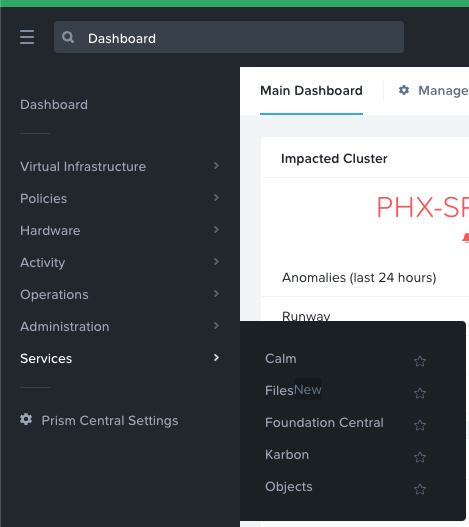
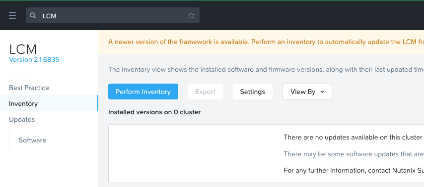
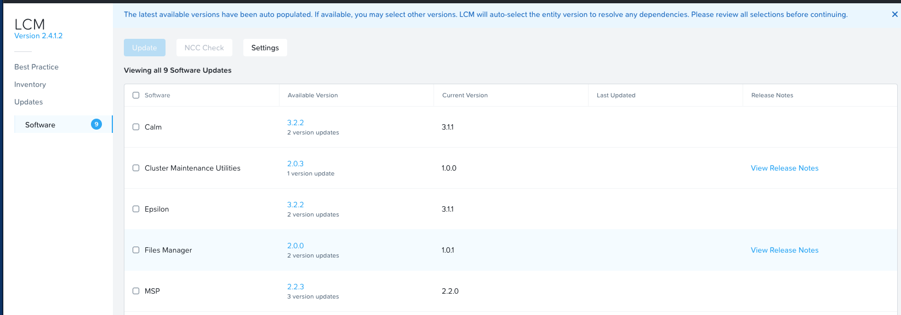
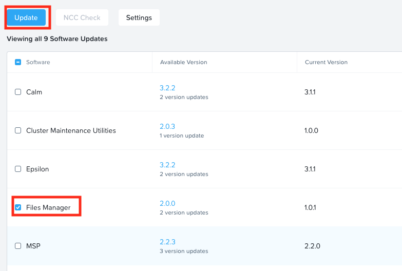
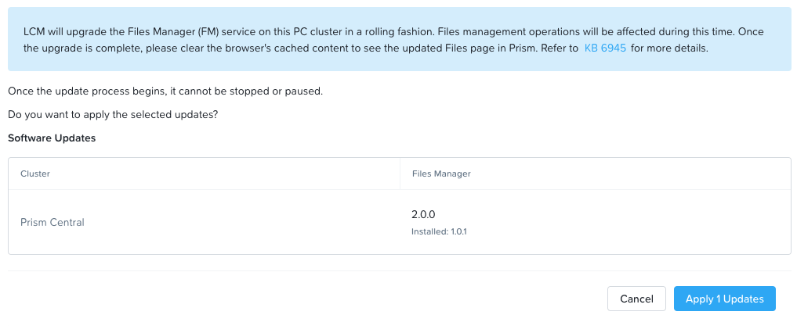
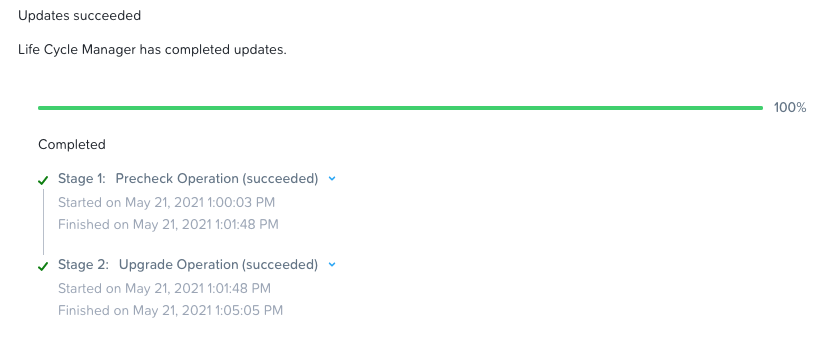
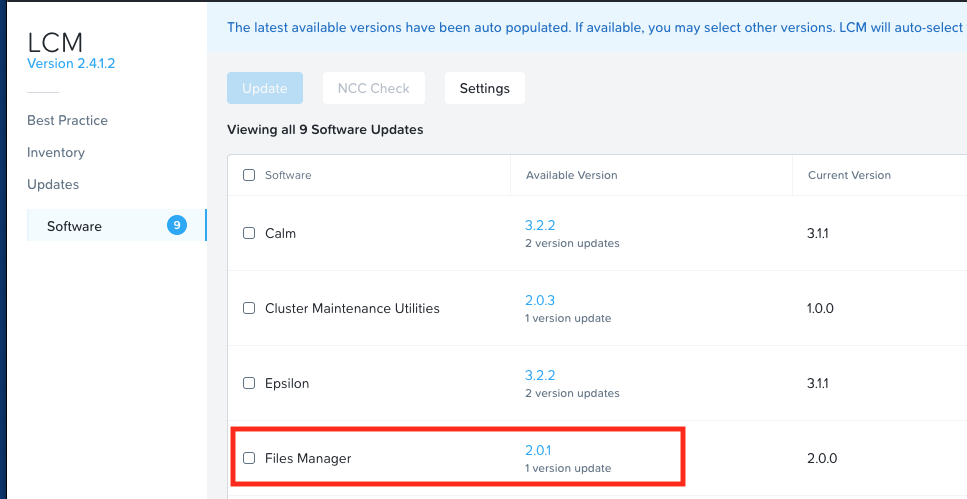
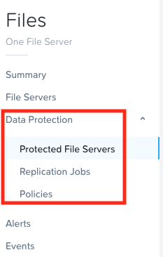

::: {#files_manager}
::: title
Files: Files Manager
:::
:::

# Files: Files Manager

Smart DR feature for Files share replication is activated and maintained
in Prism Central using Files Manager. In this section we will configure
Smart DR requirements in Prism Central.

The Files Manager lets you view and control all of your file servers
from a single control plane. Clicking a file server directs you to
Nutanix Files in Prism Element (PE) where you can manage the shares,
exports, and configurations of the file server. File server alerts for
all registered file servers appear in a single pane for consolidated
viewing, as do file server events.

The Files Manager provides the Smart DR service for Nutanix Files, which
lets you protect file servers at the share-level.

## Enabling the Files Manager

Enable the Files Manager service on PC

1.  Log on to Prism Central

2.  Click the collapsed menu icon

3.  In the **Services** \> **Files**

    

4.  Read the information on enabling the Files Manager and click
    **Enable Files**

5.  In the Enable Service dialog box, click **Enable** (if not already
    enabled)

Unable to see any new features (Data Protection)?

Upgrading Files Manager in LCM might help. See the section below to
upgrade Files Manager in LCM.

::: {#files_manager_upgrade}
::: title
Files: Files Manager Upgrade
:::
:::

## Upgrading Files Manager

Files Manger introduces new features and bug fixes with updates. For
example, Files Manager version 2.0.0 inroduced Smart DR (Disaster
Recover) feature.

You can perform Files Manager updates using the Life-Cycle Manager
(LCM).

We will verify the current version of Files Manager in Life Cycle
Management.

1.  In Prism Central, use the search window to search for **Lcm**

2.  Select **Lcm** from the search result

3.  In **Lcm**, click on **Inventory**

4.  If **Inventory** doesn\'t show any existing software versions, click
    on **Perform Inventory**

    

5.  Click on **Proceed** in the confirmation window

    ::: note
    ::: title
    Note
    :::

    The Inventory operation may take up to 30 minutes
    :::

6.  Once the Inventory operation is finished, Click on **LCM \> Updates
    \> Software** to check the available updates for software in your
    Nutanix clusters

    

7.  Here you can notice that Files Manager version `2.0.0` is available
    and you can also see that the current version `1.0.1`

8.  Select the check-box nex to **Files Manager** and click on
    **Update**

    

9.  **Life Cycle Manager** will now generate update plans and present an
    option to apply updates.

    

10. Click on **Apply 1 Updates**

    ::: note
    ::: title
    Note
    :::

    The number of updates to apply might vary from your choice of
    software that you choose to upgrade. Since Files Manager is the only
    software we are upgrading in this labs, so it is showing 1 update.
    :::

11. Confirm that the updates are succesful

    

12. After the updates are applied, go back to **Life Cycle Manager** and
    perform and **Inventory**

13. Verify that Files Manager is of version `2.0.0` (or whichever is
    latest at the time).

    

14. Go back to **Prism Central** \> **Services** \> **Files**

15. Verify that the Data Protection features are present

    

16. You can now proceed with the `files_replication`{.interpreted-text
    role="ref"} lab if required
