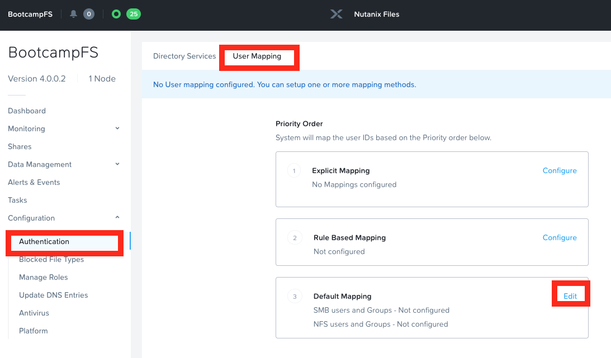
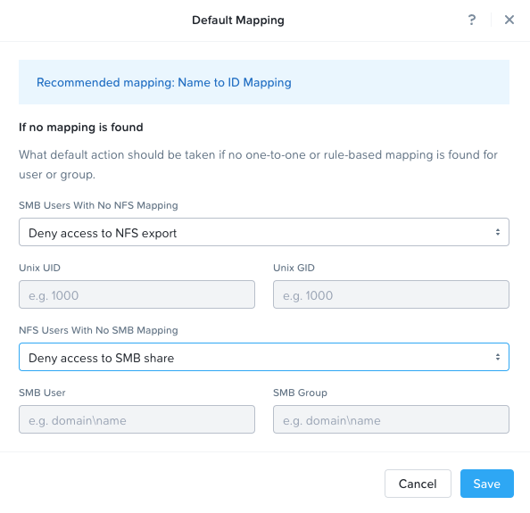
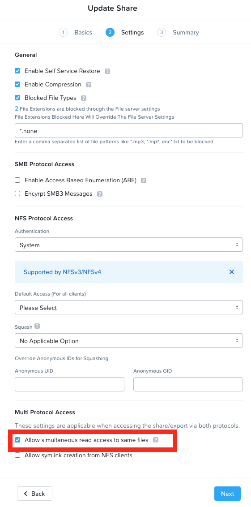
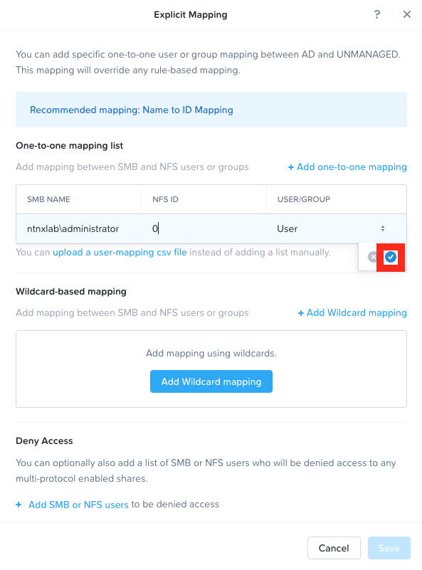

# Files: Multi-Protocol

## Multi-protocol

In this exercise you will configure an existing SMB share to also
support NFS. Enabling multi-protocol access requires you to configure
user mappings and define the native and non-native protocol for a share.

### Configure User Mappings

A Nutanix Files share has the concept of a native and non-native
protocol. All permissions are applied using the native protocol. Any
access requests using the non-native protocol requires a user or group
mapping to the permission applied from the native side. There are
several ways to apply user and group mappings including rule based,
explicit and default mappings. You will first configure a default
mapping.

1.  In **Prism Element > File Server**, select your file server and
    click **Launch Files Console**.

2.  The **Files Console** will open in a new browser tab

3.  Click on **Configuration > Authentication**

4.  Select the **User Mapping** tab

5.  In the **Default Mapping** click on **Edit**

    

6.  From the **Default Mapping** page choose both **Deny access to NFS
    export** and **Deny access to SMB share** as the defaults for when
    no mapping is found.

    

7.  Complete the initial mapping by clicking on **Save**

8.  In your BootcampFS' Files Console, click on **Shares** >
    *Initials*-Marketing share

9.  Click on three dots on the right hand corner of the
    *Initials*-Marketing share and select **Edit**

10. From the **Update Share** page check the box at the bottom which
    says **Enable multiprotocol access for NFS**.

    

11. Click **Next** then from the **Settings** page check **Allow
    Simultaneous access to the same files from both protocols**.

    

12. Click **Next** and then **Update** from the **Summary** page.

This concludes the multiprotocol configuration for your
*Initials*-Marketing share

Now we will try accessing the share to test multiprotocol configuration

You will use a Linux Tools VM as a client for your NFS Files export.

1.  Note the IP address of the VM in Prism, and connect via SSH using
    the following credentials:

    -   **Username** - root
    -   **Password** - **ask your instructor**

2.  Execute the following:

    ``` bash
    [root@CentOS ~]# mkdir /filesmulti
    [root@CentOS ~]# mount.nfs4 BootcampFS.ntnxlab.local:/Intials-Marketing /filesmulti
    [root@CentOS ~]# dir /filesmulti

    dir: cannot open directory /filesmulti: Permission denied
    [root@CentOS ~]#
    ```

    !!!note
           The mount operation is case sensitive.

    Because the default mapping is to deny access the Permission denied
    error is expected. You will now add an explicit mapping to allow access
    to the non-native NFS protocol user. We will need to get the user ID
    (UID) to create the explicit mapping.

3.  Execute the following command and take note of the UID:

    ``` bash
    [root@CentOS ~]# id
    uid=0(root) gid=0(root) groups=0(root) context=unconfined_u:unconfined_r:unconfined_t:s0-s0:c0.c1023
    ```

4.  In **Prism Element > File Server**, select your file server
    (*Initials*-Marketing)and click **Launch Files Console**.

5.  The **Files Console** for your share will open in a new browser tab

6.  Click on **Configuration > Authentication**

7.  Select the **User Mapping** tab

8.  Click on **Configure** on the **Explicit Mapping** pop out

9.  Click on **+ Add Manually**

10. Click **+ Add one-to-one mapping**

11. Fill out the following fields:

    -   **SMB Name** - ntnxlab\\administrator
    -   **NFS ID** - UID from previous step (0 if root)
    -   **User/Group** - User

12. Click on the :material-check: mark to save the mapping

    

13. Click on **Save** in the **Explicit Mapping** pop out

14. Click **Close** if any pop-ups are left

15. Go back to your Linux Tools VM and execute the following:

    ```bash
    [root@CentOS ~]# dir filesmulti
    MyMovie.flv Sample Data
    ```

You have been able to successfully configure multiprotocol access for
your *Initials*-Marketing share
