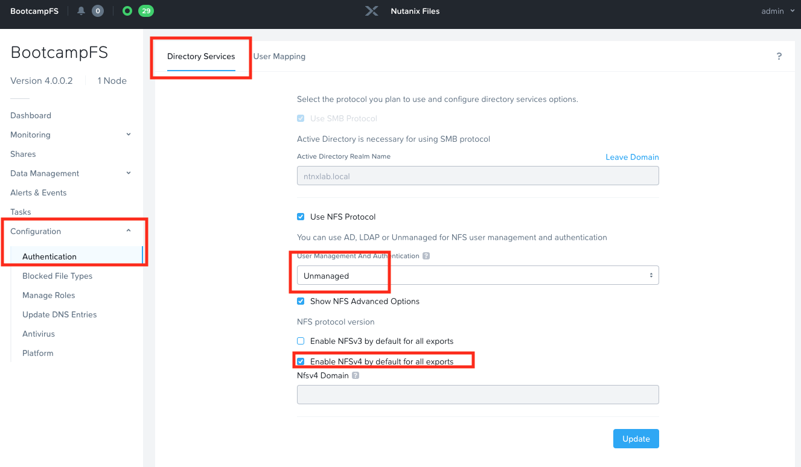
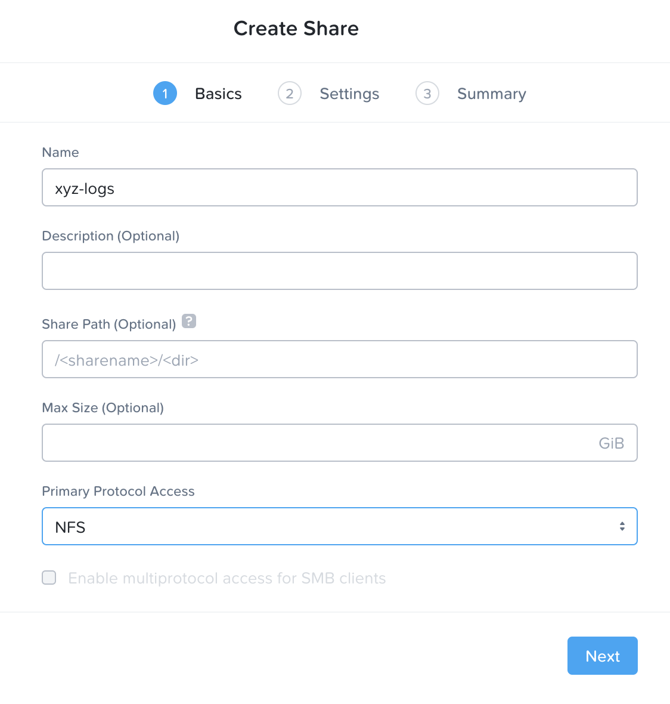
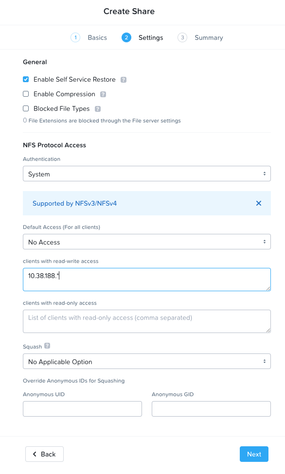
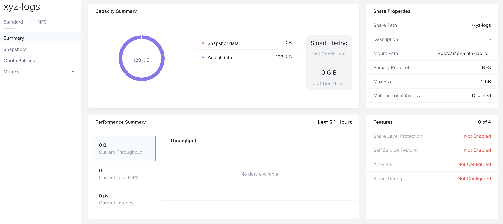

# Files: Create NFS Export {#files_nfs_export}

## Overview

In this exercise you will create and test a NFSv4 export, used to
support clustered applications, store application data such as logging,
or storing other unstructured file data commonly accessed by Linux
clients.

## Using NFS Exports

### Enabling NFS Protocol

::: note
::: title
Note
:::

Enabling NFS protocol only needs to be performed once per Files server,
and may have already been completed in your environment. If NFS is
already enabled, proceed to [Creating the Export](#creating-the-export).
:::

1.  In **Prism Element \> File Server**, select your file server and
    click **Launch Files Console**.

    

2.  The **Files Console** will open in a new browser tab

3.  Go to **Configuration** \> **Authentication** \> **Directory
    Services**

4.  Select **Use NFS Protocol** with **Unmanaged** User Management and
    Authentication, and click **Update**.

5.  Uncheck **Enable NFSv3 by default for all exports**

6.  Check **Enable NFSv4 by default for all exports** as we will only
    test NFS4 exports in this lab

    

7.  Click on **Update**

### Creating the Export

1.  In **Files Console**

2.  Select **Shares** and click on **Create a New Share**

3.  Fill out the following fields:

    -   **Name** - *Initials*-logs
    -   **Description (Optional)** - File share for system logs
    -   **Share Path (Optional)** - Leave blank
    -   **Max Size (Optional)** - Leave blank
    -   **Select Protocol** - NFS

    

4.  Click **Next**.

5.  Fill out the following fields:

    -   Select **Enable Self Service Restore**
        -   These snapshots appear as a .snapshot directory for NFS
            clients.
    -   **Authentication** - System
    -   **Default Access (For All Clients)** - No Access
        -   Click on **Add Exceptions**
    -   **Clients with Read-Write Access** - *The first 3 octets of your
        cluster network*.\* (e.g. 10.38.188.\*)

    

    By default an NFS export will allow read/write access to any host
    that mounts the export, but this can be restricted to specific IPs
    or IP ranges.

6.  Click **Next**.

7.  Review the **Summary** and click **Create**.

### Testing the Export

You will use a Linux Tools VM as a client for your NFS Files export.

::: note
::: title
Note
:::

If you haven\'t created a Linux Tools VM as part of another lab, you may
use these instructions here `linux_tools_vm`{.interpreted-text
role="ref"} to create one.
:::

1.  Note the IP address of the VM in Prism, and connect via SSH using
    the following credentials:

    -   **Username** - root
    -   **Password** - nutanix/4u

2.  Execute the following:

    ``` bash
    [root@centos ~]# sudo su - centos
    [centos@centos ~]# sudo yum install -y nfs-utils #This installs the NFSv4 client
    [centos@centos ~]# mkdir /home/centos/filesmnt
    [centos@centos ~]# sudo mount.nfs4 BootcampFS.ntnxlab.local:/xyz-logs /home/centos/filesmnt
    [centos@centos ~]# df -kh
    Filesystem                      Size  Used Avail Use% Mounted on
    /dev/mapper/centos_centos-root  8.5G  1.7G  6.8G  20% /
    devtmpfs                        1.9G     0  1.9G   0% /dev
    tmpfs                           1.9G     0  1.9G   0% /dev/shm
    tmpfs                           1.9G   17M  1.9G   1% /run
    tmpfs                           1.9G     0  1.9G   0% /sys/fs/cgroup
    /dev/sda1                       494M  141M  353M  29% /boot
    tmpfs                           377M     0  377M   0% /run/user/0
    BootcampFS.ntnxlab.local:/      1.0T  7.0M  1.0T   1% /home/centos/filesmnt

    [centos@centos ~]# ll /home/centos/filesmnt/
    total 0
    ```

3.  Observe that the **logs** NFS share is mounted in
    `/home/centos/filesmnt`.

4.  Reboot the VM and observe the export is no longer mounted. To
    persist the mount, add it to `/etc/fstab` by executing the
    following:

    ``` bash
    [root@centos ~]# exit # centos user logout 
    [root@centos ~]# reboot 
    ```

    ``` bash
    # Login to your LinuxToolsVM again
    [yourdesktop ~]# ssh -l root <LinuxToolsVMIPAddress> 
    ```

    ``` bash
    [root@centos ~]# echo 'BootcampFS.ntnxlab.local:/xyz-logs /home/centos/filesmnt nfs4' >> /etc/fstab
    [root@centos ~]# mount /home/centos/filesmnt
    ```

5.  Once an mount entry is added to `/etc/fstab`, reboot the VM again.
    This is required in some cases where mounts don\'t persist.

6.  The following command will add 100 2MB files filled with random data
    to `/filesmnt/logs`:

    ``` bash
    [root@centos ~]# sudo su - centos

    [centos@centos ~]# mkdir /home/centos/filesmnt/host1
    [centos@centos ~]# for i in {1..100}; do dd if=/dev/urandom bs=8k count=256 of=/home/centos/filesmnt/host1/file$i; done
    ```

7.  Return to **Files Console**

8.  Click on **Shares \> logs** to monitor performance and usage of you
    NFS export.

    ::: note
    ::: title
    Note
    :::

    Note that the utilization data is updated every 10 minutes.
    :::

    
