!!!info
        The estimated time to complete this lab is 60 minutes

## Overview

Smart disaster recovery (DR) is a data protection service for Nutanix
Files.

Smart DR facilitates share-level data replication and file-server-level
disaster recovery. In the event of a planned or unplanned loss of
service, you can restore write access to protected shares by
failing-over to a recovery site file server. Protection policies
indicate failover details, including the primary location, recovery
location, and the replication schedule. Rather than having a single
protection policy for an entire file server, you can configure unique
policies for different shares.

A short recovery time objective (RTO), helps ensure continuous
availability of data once you fail over to a recovery site. Configuring
Active Directory (AD) and domain name system (DNS) entries facilitates
seamless client access redirection.

The following figure gives an overview implementation of Replication in
Nutanix Files.

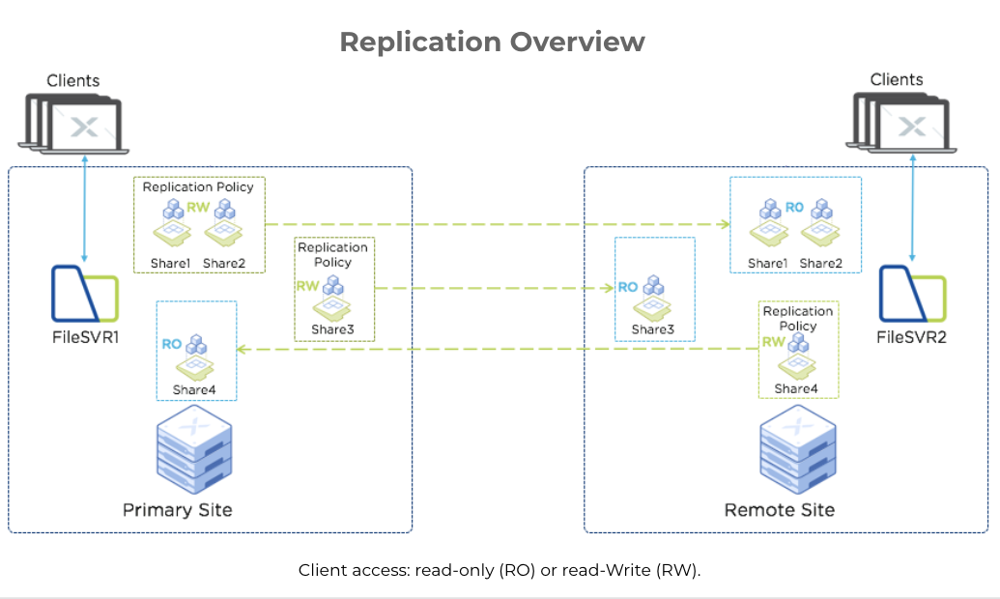

### Typical Data Protection Setup for Smart DR

The data protection process consists of the following procedures:

-   Configuring a Files Protection Policy to replicate share data to a
    recovery site
-   Configuring AD and DNS access for seamless client failover (if AD is
    different)
-   Configuring a reverse replication policy
-   Performing a planned or unplanned failover to DR site
-   Failing back to the primary site

The following flowchart illustrates the decision making process for a
share replication (Smart DR) setup.

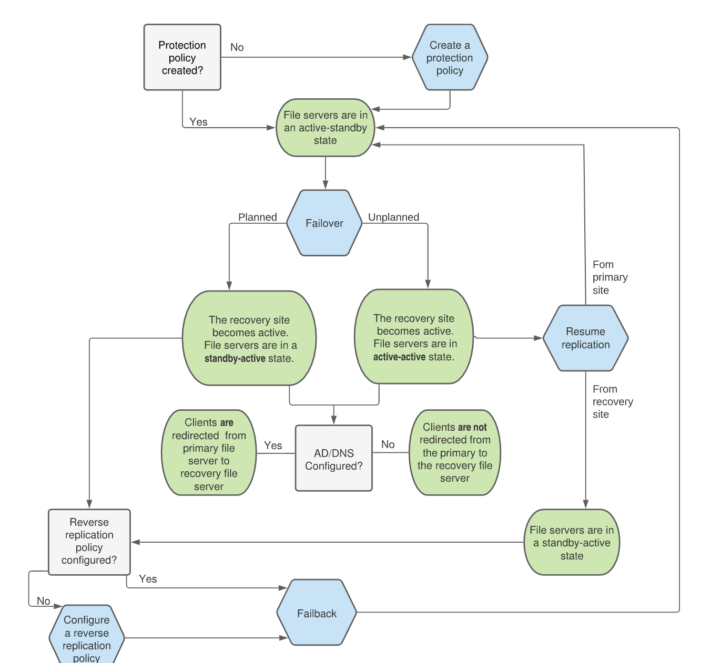

### Lab Setup

In this lab we will configure replication between of shares between two
Files servers on the same HPOC cluster.

Since we are doing this lab on a single HPOC cluster, we will have a
single AD domain.

We will do the following:

1.  Create a PROD Files server *initials*-filess-prod (1-VM Files
    Server)
2.  Create a DR Files server *initials*-files-dr (1-VM Files Server)
3.  Create a SMB Files share in your PROD Files server and populate the
    share with sample files
4.  Configure Files Protection Policy in Prism Central's
    [Files Manager](../files_manager/files_manager.md) and replicate
5.  Failover, create new files in share and reverse-replicate
6.  Failback and check contents

Files version include new feature updates. At the time of writing this
labs these were the required versions of the following software
components:
### Software Version

- AOS               5.20.2
- Prism Central     pc.2021.9.0.2
- Files             4.0.0.2
- Files Manager     2.0.0 (upgraded through LCM)

Click here for instructions to enable and update  [Files Manager](../files_manager/files_manager.md)
### Create PROD Files Server

1.  In **Prism > File Server**, click **+ File Server**

2.  Click **Continue** on *New File Server: Pre-check* window (if it
    appeares)

3.  Fill out the following fields:

    -   **Name** - *initials*-files-prod (e.g. XYZ-files-prod)
    -   **Domain** - ntnxlab.local
    -   **File Server Size** - 1 TiB

4.  Click on **Customize**

    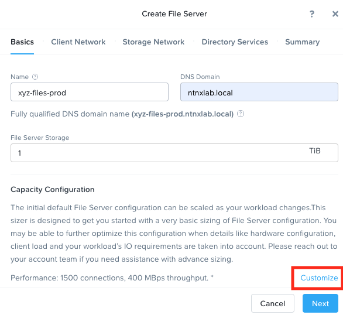

5.  Click **Configure manually**

    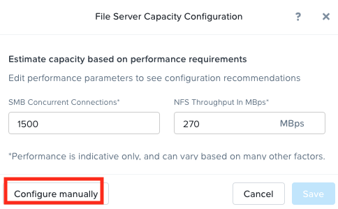

6.  Drop-down the **NUMBER OF FILE SERVER VMS** to **1**

    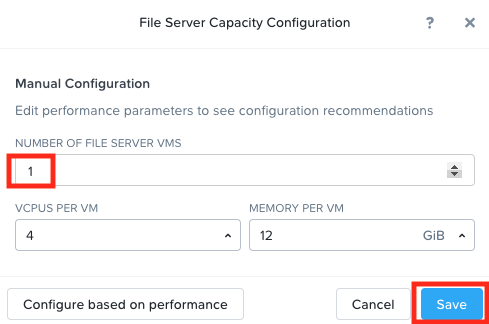

7.  Click on **Save** and **Next**

8.  Select the **Primary - Managed** VLAN for the **Client Network**.

9.  Click **Next**.

10. Select the **Primary - Managed** VLAN for the **Storage Network**.

    !!!note

            Ideally, two different networks should be selected for Client and
            Storage network in production environments. But since this is a lab,
            we will be only using one network.
 
11. Click **Next**.

12. Fill out the following fields:

    -   Select **Use SMB Protocol**
    -   **Username** - <administrator@ntnxlab.local>
    -   **Password** - nutanix/4u
    -   Select **Make this user a File Server admin**

    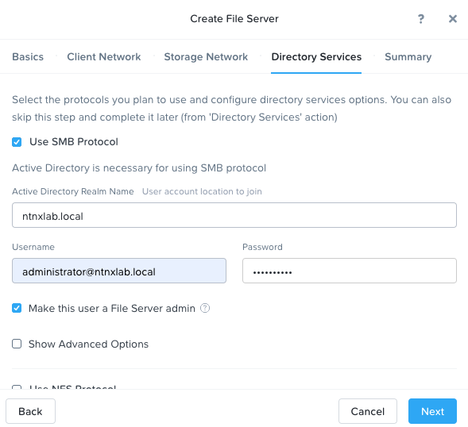

13. Click **Next**.

    By default, Files will automatically create a Protection Domain to
    take daily snapshots of the Files cluster and retain the previous 2
    snapshots. After deployment, the snapshot schedule can be modified
    and remote replication sites can be defined.

    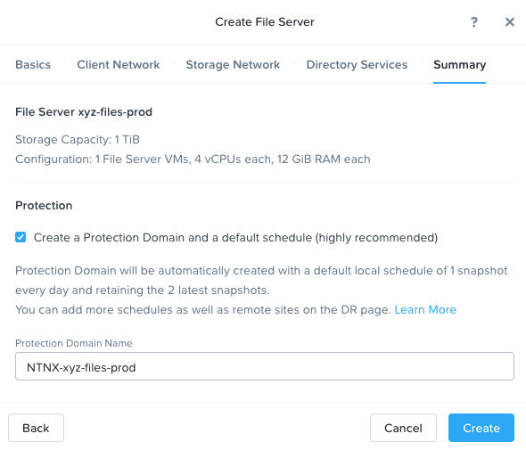

14. Click **Create** to begin the Files deployment.

15. Monitor deployment progress in **Prism > Tasks**.

    Deployment should take approximately 10 minutes. While it is
    deploying please proceed to next section.

    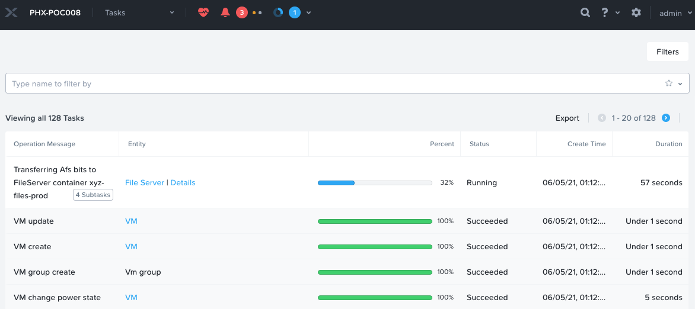

### Create DR Files Server

1.  Repeat steps 1 - 15 in the previous section to create DR Files
    Server with the following details:

2.  Fill out the following fields(make sure to manually configure Files
    server to 1 VM):

    -   **Name** - *initials*-files-dr (e.g. XYZ-files-dr)
    -   **Domain** - ntnxlab.local
    -   **File Server Size** - 1 TiB

3.  Now you should have two Files Servers showing in Prism Element
    **Prism > File Server**

    

### Create a SMB Files Share in your PROD Files Server

In this section we will create a source files shares to serve as a
source and then we will replicate this share subsequently.

1.  In **Prism Element > File Server**, click on your
    **initials**-files-prod (e.g. XYZ-files-prod) File Server

2.  Click on **Launch Files Console** (this will open in a new tab)

3.  Click on **Create a New Share**

4.  Fill in the following details:

    -   **Name** - **initials**-prod-share （e.g. XYZ-prod-share）
    -   **Primary Protocol Access** - SMB (confirm this to be SMB)
    -   Leave everything else as blank

    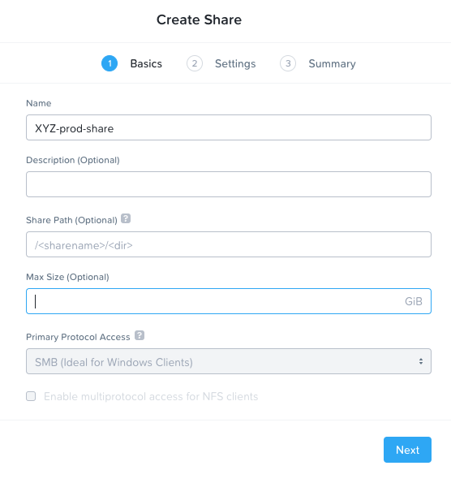

5.  Click **Next**

6.  In **Settings** section, select the following:

    -   Enable Self Service Restore
    -   Enable Compression
    -   Enable Access Based Enumeration (ABE)

    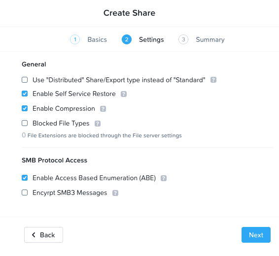

7.  Click **Next**

8.  Confirm your share settings and click on **Create**

    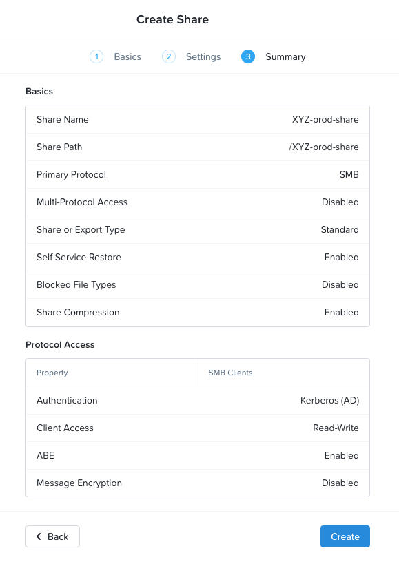

9.  Login to your Windows Tools VM with the following credentials

    - **Username** - <administrator@ntnxlab.local>
    - **Password** - nutanix/4u

10. Browse to the location of your PROD (Source) share (e.g.
    ``\\xyz-files-prod.ntnxlab.local\xyz-prod-share``)

    !!!note
           You can find your PROD share location by selecting the Files Share
           in Prism Element and checking Share/Export details.

11. Download the following [Sample Zip File](http://10.42.194.11/workshop_staging/peer/SampleData_Small.zip)
    and unzip it in your PROD share

    

### Configure Files Protection Policy in Prism Central and Replicate

Smart DR feature for Files share replication is activated and maintained
in Prism Central using Files Manager. In this section we will configure
Smart DR requirements in Prism Central.

The Files Manager lets you view and control all of your file servers
from a single control plane. Clicking a file server directs you to
Nutanix Files in Prism Element (PE) where you can manage the shares,
exports, and configurations of the file server. File server alerts for
all registered file servers appear in a single pane for consolidated
viewing, as do file server events.

The Files Manager provides the Smart DR service for Nutanix Files, which
lets you protect file servers at the share-level.

1.  Logon to Prism Central

2.  Click on :fontawesome-solid-bars: > Services > Files

    !!!note

           If Files Manager is not enabled in your Prism Central, you will need
           to Enable Files using instruction in [Files Manager](../files_manager/files_manager.md)

        　　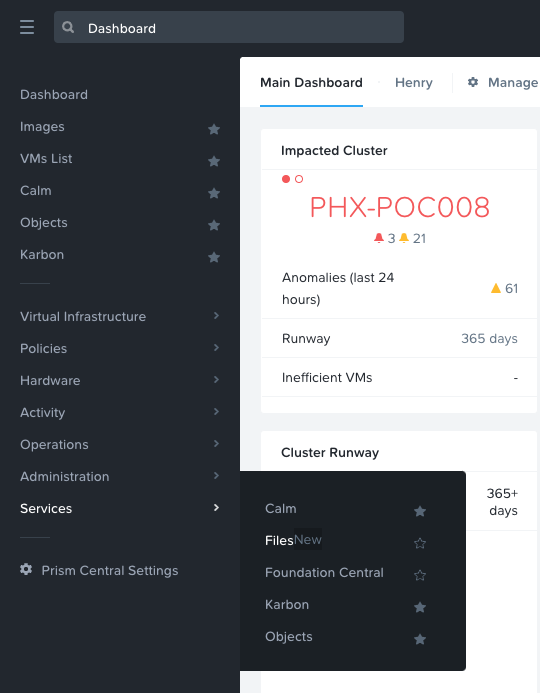

3.  In Files Manager, click on **Data Protection > Polices > + New Policy**

4.  Select your **initials**-files-prod (e.g. XYZ-files-prod) as the **Primary Location (Source File Server)**

    !!!note

           Selecting the source Files server will automatically select all the shares within this files server to be protected
    
5.  Select your **initials**-files-dr (e.g. XYZ-files-dr) as the **Recovery Location (Target File Server)**

6.  Select the **Recovery Point Objective (RPO)** as **10** minutes and
    **Start Immediately**. (this is the lowest you can set as of now)

    !!!note 
           You can ignore the following warning as the this is just a test for
           Smart DR feature. In a customer environment the source and Target
           Files servers will be in different AOS clusters.
       
           **xyz-files-dr** is on the same AOS cluster as the source. It is
           recommended to have target file servers on a different AOS
           cluster.

7.  Make sure your selection looks as follows:

    

8.  Click on **Next** at the bottom of the screen

9.  Fill in the following details in **Settings** section:

    -   **Name** - *initials*-files-repl-policy (e.g.xyz-files-repl-policy)
    -   **Description** - Protection Policy for XYZ Prod to DR Replication (Optional)

10. Click on **Create**

11. Monitor the Tasks until the policy is created and the policy should
    show in the **Data Protection > Polices > + New Policy** in a few
    minutes

    

    Wait a few minutes until all the files are replicated and **RPO Compliant** will have a green-dot to indicate initial synchronization

12. Go to **Data Protection > Replication Jobs** and observe the
    replication jobs and duration. The initial replication will take time
    based on the amount of data and network speeds. But the subsequent
    replications will be based on incremental changes only.

    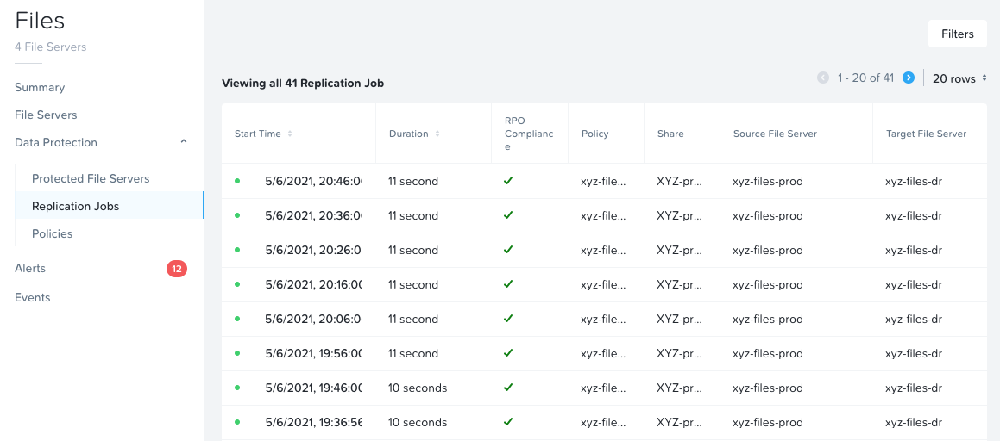

13. Go to **Data Protection > Protected File Servers** to check the Active and Standby File servers. (Active indicated by a green A)

    

14. Verify it shows the DR Files Server with the source PROD share (e.g.``\\xyz-files-dr.ntnxlab.local\xyz-prod-share``)

### Failover Share

We have set up replication of a share between two Files servers. Now we are able to test failover of the share to the DR File server.

There are two failover methods:

-   Planned Failover - allows a reverse-replication to the source File Server
-   Unplanned Failover - no reverse-replication (as an admin doesn't know when the primary site will be operational again)

Both these methods are manually triggered by an administrator.

In this lab we will test a Planned Failover

1.  Go to **Prism Central > Services > Files** (if you are note already on that page)

2.  Go to **Data Protection > Protected File Servers**

3.  Click on **Failover** as shown here

    

4.  Select **Planned Failover**

5.  Select **Create a Reverse-Replication Policy** and fill in the
    following

    - **Recovery Point Objective (RPO)** - 10 minutes
    -   **Policy Name** - Reverse-*initials*-files-repl-policy (e.g. Reverse-xyz-files-repl-policy)

    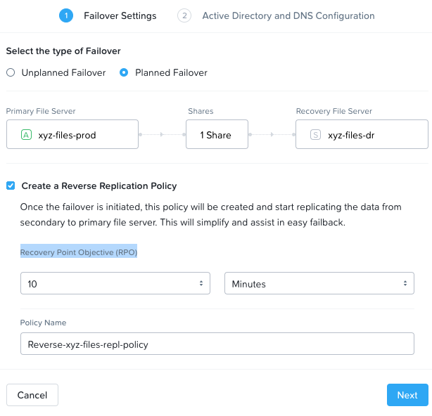

6.  Click **Next**

7.  In the **Active Directory and DNS Configuration** fill the following:
    (to ensure access to files after failover)

    -   **Username** - <administrator@ntnxlab.local>
    -   **Password** - nutanix/4u
    -   **Preferred Domain Controller** - ntnxlab.local
    -   **Preferred Name Server** - 10.X.X.41 (Your AD IP address)

8.  Select the **Use the same credentials as the Active Directory**
    check-box (in our lab both the AD and DNS server are the same)

9.  Click on **Failover**

10. Monitor the Events in Prism Central

11. Once Failover is completed, return to **Files > Data Protection > Protected File Servers** in Prism Central and check the Active and Standby File servers. (Active indicated by a green A)

12. Confirm that *initials*-files-dr (e.g. xyz-files-dr) server is now
    the active server

    

13. Return to your Windows Tools VM and access the failed over share in
    Windows Explorer

14. Login to your Windows Tools VM with the following credentials

    -   **Username** - <administrator@ntnxlab.local>
    -   **Password** - nutanix/4u

15. Browse to the location of your source share now hosted on PROD and
    DR Files server

    -   Prod path - ``\\xyz-files-prod.ntnxlab.local\xyz-prod-share``
    -   DR path - ``\\xyz-files-dr.ntnxlab.local\xyz-prod-share``

    

     This demonstrates that the users can access the share without having the change the file server names providing continuous access to the shares.

16. Logon to your AutoAD server and open DNS management (from Search
    button > type DNS )

    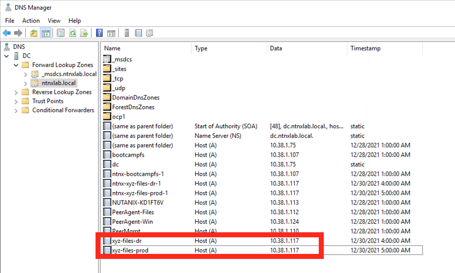

    You can notice that both PROD and DR file servers have the same IP address

17. Go to **Data Protection > Replication Jobs** and verify that the source Files server is now **initials**-files-dr (e.g. xyz-files-dr) server

    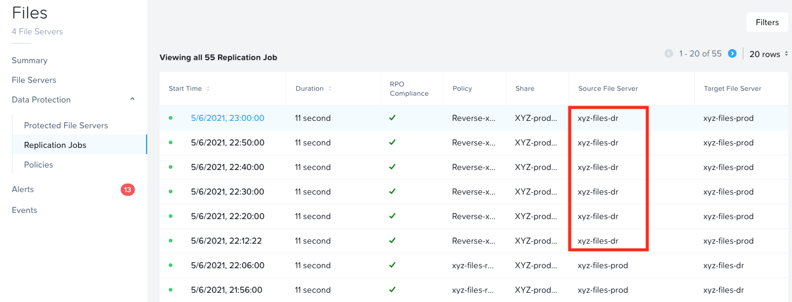

18. Go to **Data Protection > Policies** and verify a reverse replication policy is present

    

19. The replication is now setup successfully

20. Create some sample files in your share as shown here so Failback can be tested

    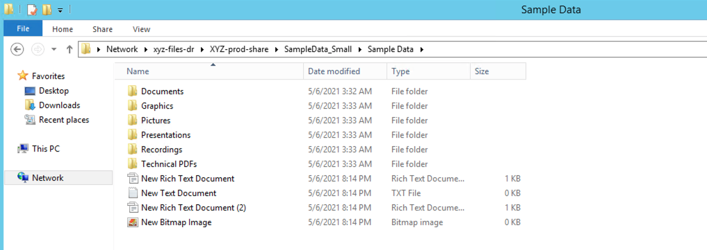

21. Wait for at least 10 minutes for the reverse replication schedule to start

22. Confirm at least one reverse replication schedule to PROD Files server has successfully completed by going **Data Protection > Replication Jobs**

### Failback Share

In this section we will see how to failback a share to the Source site after the environment is recovered.

In this lab we will test a Planned Failover

1.  Go to **Prism Central > Services > Files** (if you are not already on that page)

2.  Go to **Data Protection > Protected File Servers**

3.  Click on **Failback** as shown here

    

4.  In the **Active Directory and DNS Configuration** fill the following (to ensure access to files after failover)

    -   **Username** - <administrator@ntnxlab.local>
    -   **Password** - nutanix/4u
    -   **Preferred Domain Controller** - ntnxlab.local
    -   **Preferred Name Server** - 10.X.X.41 (Your AD IP address)

5.  Select the **Use the same credentials as the Active Directory** check-box (in our lab both the AD and DNS server are the same)

6.  Click on **Next**

7.  Files now gives you a visual of the failed-back environment and informs you that the Reverse Replication policy will be deleted

    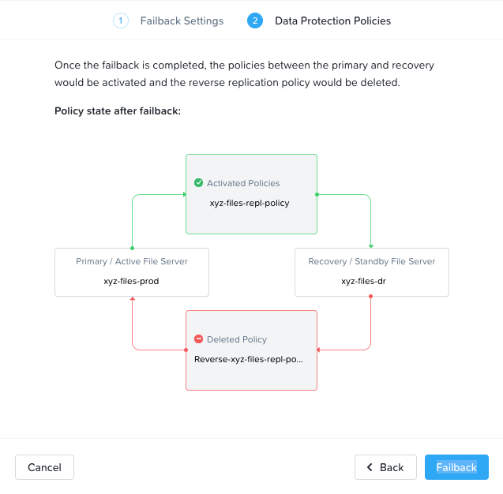

8.  Click on **Failback**

9.  Monitor the Events in Prism Central

10. Once the failover is done, go to your Windows Tools VM and logon to the share hosted on PROD files server (e.g
    ``\\xyz-files-prod\xyz-prod-share\SampleData_Small\Sample Data`` )

11. Logon to your AutoAD server once again and open DNS management (from Search button > type DNS )

    

    You can notice that the PROD file server has been reverted to the previous IP address.

12. Logon to your AutoAD server once again and open DNS management (from Search button > type DNS )

    

    You can notice that the PROD file server has been reverted to the previous IP address.

13. Note that the new files that were created when the share was on DR
    server are now present on the PROD server as well

    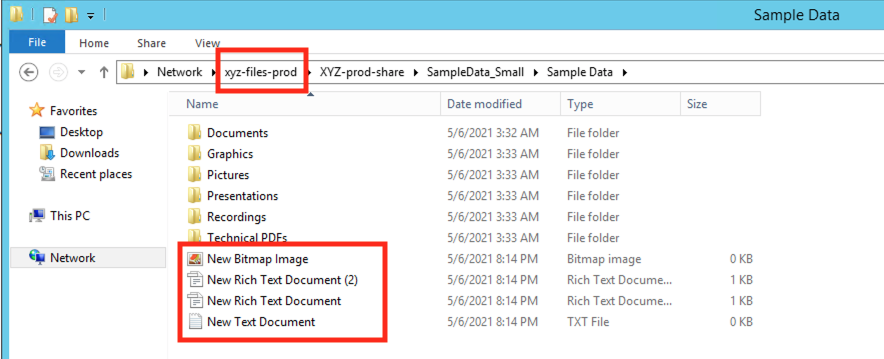

14. We have successfully failed back the share to the PROD site. Now users can connect to the share as usual.

### Conclusion

Nutanix Files Smart DR makes it easy for administrators to configure replication of shares between Nutanix Files servers without needing third-party integrations.

For information about Files Manager and Smart DR features, refer to this documentation
[URL](https://portal.nutanix.com/page/documents/details?targetId=Files-Manager-v2_0:fil-fm-dr-c.html).
