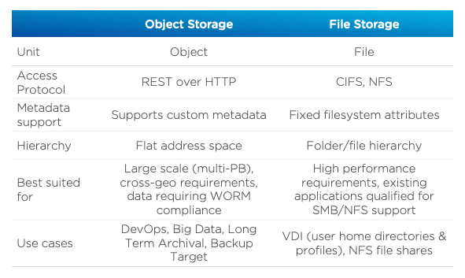
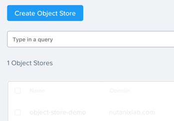
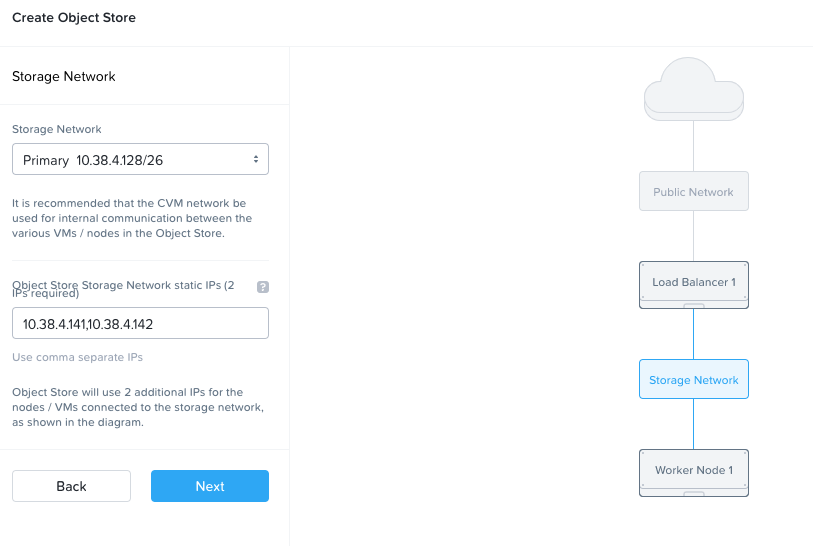
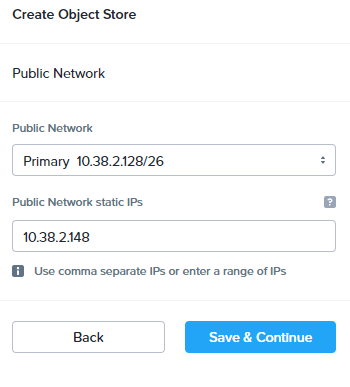
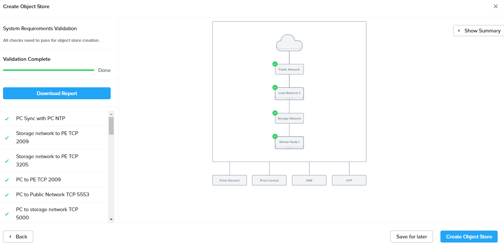

# Objects: Deploy

## Overview

Data is growing faster than ever before, and much of the new data
generated every second is unstructured. Video, backups, images, and
e-mail archives are all examples of unstructured data that can cause
issues at scale using traditional file and block storage solutions.

Unlike file or block storage, object storage is a data storage
architecture designed for unstructured data at the petabyte scale.
Object storage manages data as objects, where each object contains the
data itself, a variable amount of metadata, and a globally unique
identifier. There is no filesystem overhead as there is in block and
file storage, so it can be easily scaled out at a global level.

Nutanix Objects is an S3-compatible object storage solution that
leverages the underlying Nutanix storage fabric which allows it to
benefit from features such as encryption, compression, and erasure
coding (EC-X).

Objects allows users to store petabytes of unstructured data on the
Nutanix platform, with support for features such as WORM (write once,
read many) and object versioning that are required for regulatory
compliance, and easy integration with 3rd party backup software and
S3-compatible applications.

**What are the use cases for Nutanix Objects?**

-   DevOps

    -   Single global namespace for multi-geography collaboration for teams spread around the world
    -   S3 support
    -   Time-to-first-byte of 10ms or less

-  Long Term Data Retention

    -   WORM compliance
    -   Object versioning
    -   Lifecycle policies

-  Backup Target
   
    -   Support for HYCU, Commvault, Veeam, Veritas, and others that accept S3 as backup target.
    -   Ability to support multiple backup clients simultaneously.
    -   Ability to handle really small and really large backup files
        simultaneously with a key-value store based metadata
        structure and multi-part upload capabilities.

**In this lab, you will walk through a Nutanix Objects deployment and
learn how to create, access, and manage buckets.**

For more information on Objects, please visit our [website](http://www.nutanix.com/products/objects) or send an [e-mail](objects@nutanix.com) to contact the Nutanix Objects team!

## Lab Setup

This lab requires applications provisioned as part of the Windows Tools VM which is pre-deployed for you.

!!!note
        Google Chrome is required for this lab.

## Getting Familiar with Object Storage

An object store is a repository for storing objects. Objects are stored
in a flat hierarchy and made up of only 3 attributes - an unique key or
identifier, the data itself, and an expandable amount of metadata. An
object store is a single global namespace on which buckets can be
created. A bucket can be thought of as similar to a folder in a file
storage environment. However, object storage and file storage are very
different. Here are some ways object storage and file storage differ.

## Getting Familiar with the Nutanix Objects Environment

This exercise will familiarize you with the Nutanix Objects environment.
You will learn:

-   What constitutes the Microservices Platform (MSP) and the services
    that make up Nutanix Objects.
-   How to deploy an Object Store

### View the Object Storage Services

1.  Login into your Prism Central instance.

2.  In Prism Central, select :fontawesome-solid-bars: **> Services > Objects**.

    View the existing Object Stores. You will be using the
    **ntnx-objects** Object Store throughout this lab.

3.  Select :fontawesome-solid-bars: **> Virtual
    Infrastructure > VMs**.

    For the lab deployment, you will see 2 VMs, each preceded with the
    name of the object store.

    !!!info "Objects VM Resource Requirements"

            In a production environment, there would be at a least 5 VMs - 3
            worker VMs (default) and 2 load balancers (envoy). In Medium and
            Large deployments there would be additional worker and load balancer
            VMs.

            For example, if the name of the object store is **ntnx-objects**,
            there will be a VM with the name **ntnx-objects-envoy-1**.

            | VM             | Purpose                       | vCPUs | Memory     |
            |----------------|-------------------------------|---------|-----------|
            | default-0    |  Kubernetes Node             | 10 | 32 GiB      |
            | envoy-0      |  Load Balancer / Endpoint    |  2 | 4 GiB        |
      

These VMs are deployed by the Microservices Platform (MSP), the
Kubernetes-based platform on which multiple future Nutanix services will
be run. The service that controls the MSP runs on Prism Central.

The **default** VMs run the Kubernetes cluster. The Kubernetes cluster
consists of one or more master nodes, which provides the control plane
for the Kubernetes cluster, as well as worker nodes. Kubernetes runs in
multi-master mode, which allows for any node to become the master if
needed.

These nodes run etcd, which is a Kubernetes-level distributed key-value
store for storing and replicating the Kubernetes-cluster level metadata.
The nodes also run the object store components. This includes:

-   S3 adapter - Translates the S3 language into the internal system
    language
-   Object controller - Handles all the I/O
-   Metadata service - Distributed key-value store to provide
    consistency across a massive object store deployment
-   Atlas service - Handles garbage collection and enforces policies
    such as life cycle management, versioning, and WORM
-   UI gateway - this is the endpoint for all UI requests, handles
    bucket management, stats display, user management interface, etc
-   Zookeeper - Manages the configuration for the object storage cluster
-   IAM service - Handles user authentication for accessing buckets and
    objectsd

The envoy VMs provide load balancing across the object controller
components. The IP address of these VMs are the IP that can be used by
clients to access the object store. It is the first point of entry for
an object request (for example, an S3 GET or PUT). It then forwards this
request to one of the worker VMs (specifically, the S3 adapter service
running as part of the object-controller pod).

### Walk Through the Object Store Deployment

In this exercise you will walk through the steps of creating an Object
Store.

!!!warning 

       You will not actually deploy the Object Store, but you will be able to see the workflow and how simple it is for users to deploy an Object Store.

???info "Are you thinking of a Global namespace design?"

       In many use cases only a single object store is required. If global
       namespace isolation is required, for example if a Service Provider is
       providing object storage to multiple customers from the same cluster,
       then multiple object stores can be created.

1.  In Prism Central, select :fontawesome-solid-bars: **>Services > Objects**, click **Create Object Store**.

    

2.  Review the prerequisites and click **Continue**.

3.  Fill out the following fields:

    -   **Object Store Name** - oss-*initials*
    -   **Cluster** - your cluster (e.g. PHX-POCXXX)
    -   **Worker nodes** - 1
    -   **Domain** - ntnxlab.com

    

4.  Click **Next**.

5.  In Storage network settings choose **Primary Network**

6.  Provide two available IP addresses for Object Store Storage Network
    static IPs (2 IPs required)

    Select two available IPs in your network (just ping a few IPs in
    your cluster's subnet to check if they are avaialable or use a port
    scanner to determine this)

    

7.  Click **Next**

8.  In Public network settings choose **Primary Network**

9.  Provide four available consecutive IP addresses in a range, for
    Object Store Storage Network static IPs (4 IPs required)

    Select four available IPs in your network (just ping a few IPs in
    your cluster's subnet to check if they are avaialable or use a port
    scanner to determine this)

    

10. Click on **Save and Continue**

11. The wizard will run through all System Requirements Validation to
    validate resources for Objects store deployment

12. You will see a confirmation screen once all the validation checks
    are run

    

13. **Do not** click on the Create Object Store button. The HPOC
    doesn't have enough resources to be able to host another Objects
    Store.

## Takeaways

What are the key things you should know about **Nutanix Objects**?

-   Nutanix Objects provides a simple and scalable S3-compatible object
    storage solution, optimized for DevOps, Long Term Retention and
    Backup Target use cases.
-   Nutanix Objects can be deployed on an AHV and ESXi clusters on Nutanix.
-   Nutanix Objects will be enabled and deployed from Prism Central.
