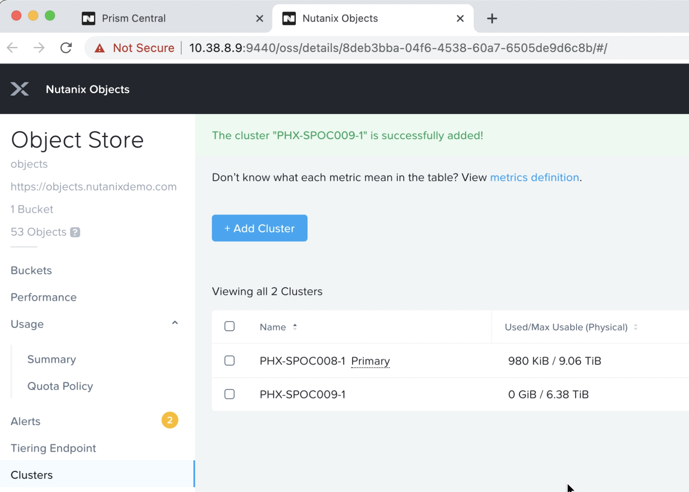
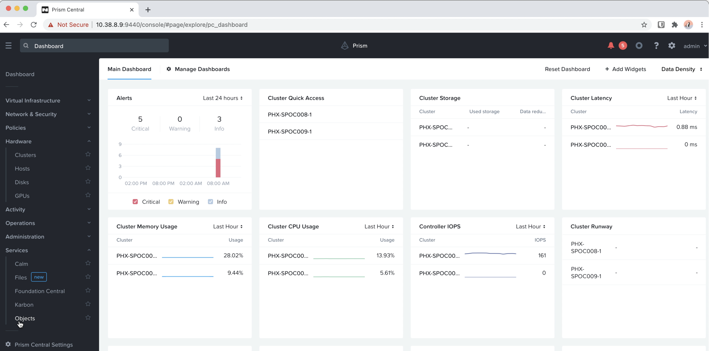
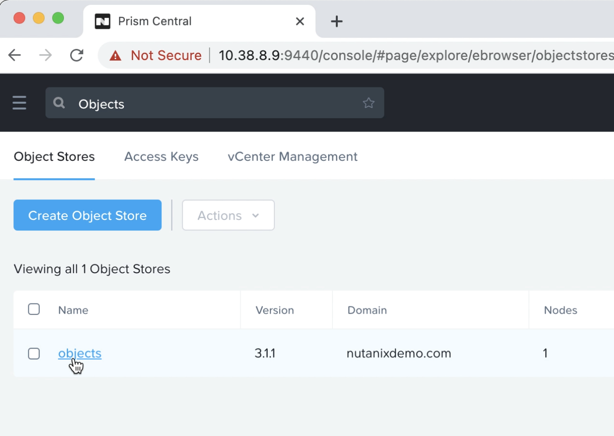
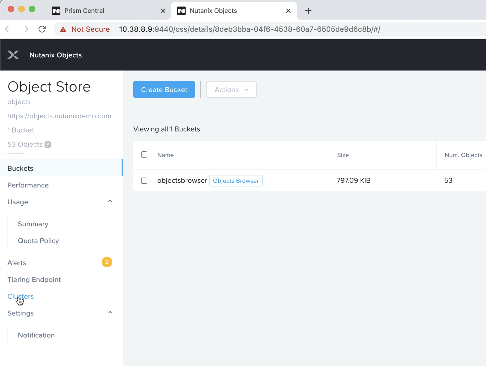
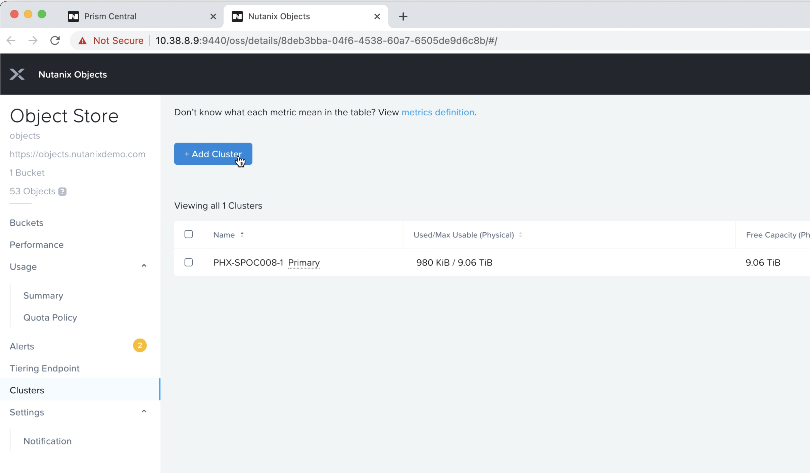
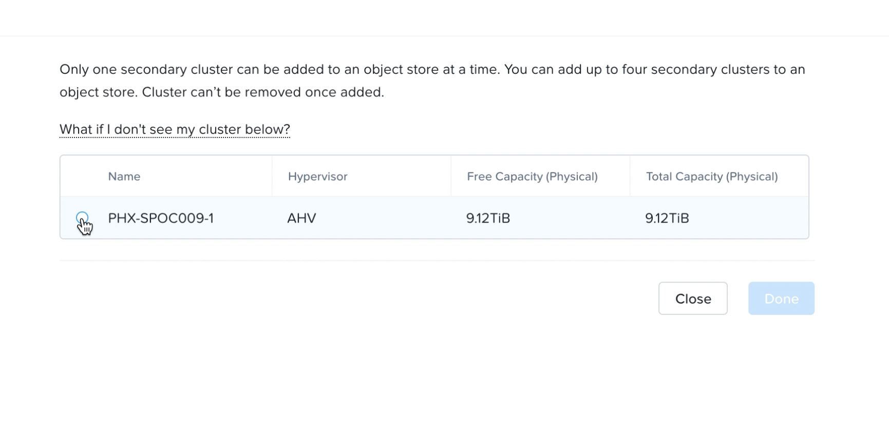
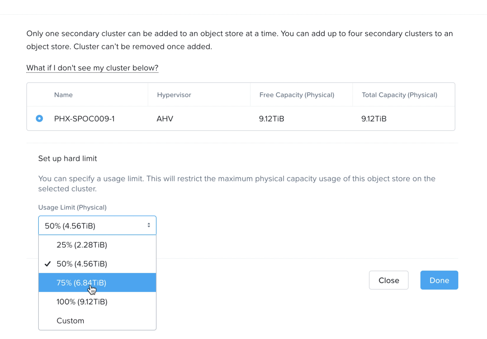
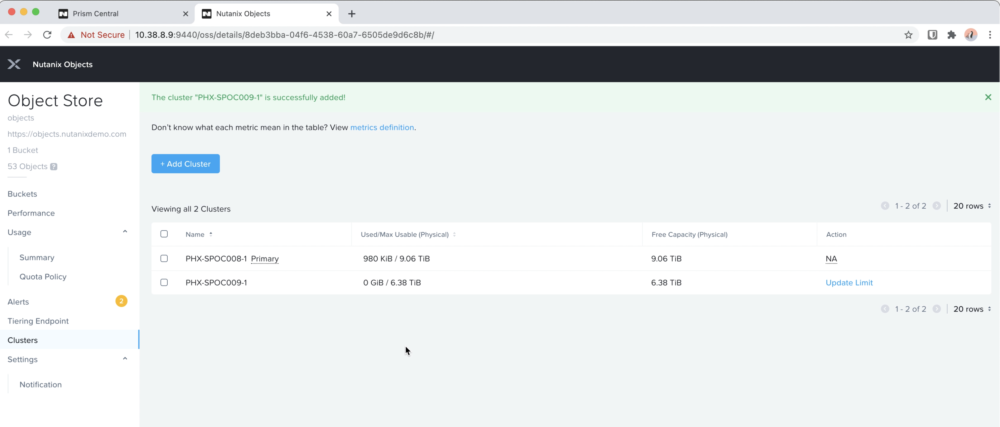

# Objects: Multi-cluster

!!!info
       The estimated time to complete this lab is 10 minutes.

## Overview

Data Storage can be expensive and often object stores can scale to very
large deployments well into the PetaBytes. Customers need the ability to
deploy large scale clusters that can scale across multiple AOS clusters.
Nutanix Objects enables customers to do that using the Multi-Cluster
feature.

## Objects Multi-Cluster

Nutanix Objects Multi-Cluster is able to scale across any AHV or vSphere
cluster that meets the following criteria:

-   Joined to the same Prism Central as primary Objects cluster
-   Has remain storage capacity
-   Is running AOS 5.11.2+
-   Located in same datacenter as primary cluster

!!!warning
          Multi-Cluster is not suitable for cross-WAN communication

## Lab Setup

In this lab, you will only walk through a Nutanix Objects
Multi-Cluster feature assuming your Prism Central has two registered
Prism Element clusters

At high level we will implement the following:

-   An Objects instance that utilizes the storage of two AOS clusters

!!!note
        Google Chrome is required for this lab.

### Setup Objects Multi-Cluster

In the following section you will see how easily you can add additional
storage capacity from other Nutanix AOS clusters into your Nutanix
Objects deployment.

1.  In Prism Central, select :fontawesome-solid-bars: **> Services > Objects**

    

2.  Choose your **Objects Store**

    

3.  Click on **Clusters**

    

4.  Choose **Add Cluster**

    

5.  Select your secondary cluster

    !!!note
           Only compatible clusters will appear in this window. Nutanix Objects
           will only use storage on secondary cluster, no additional compute
           resources are required.

    

6.  Configure storage limitations for Nutanix Objects on secondary
    cluster and click **Done**

    !!!note 

           Storage will be utilized in a round-robin fashion across all of the
           clusters registered to Objects Multi-Cluster. Once a cluster nears
           it's storage hard limit, it will be placed into a secondary pool,
           receiving no further writes until all clusters registered are placed
           in that secondary pool. This ensures no cluster runs out of storage.

    

7.  View Clusters Listed in **Clusters** pane

    !!!note

           Secondary cluster storage will be made available within just a
           couple of minutes after adding it to Multi-Cluster.

    

## Takeaways

What are the key things you should know about **Nutanix Objects Multi-Cluster**?

-   Nutanix Objects allows easy configuration for adding additional AOS
    clusters to your object store deployment
-   Intelligent distribution of data allows storage to be properly
    utilized across clusters of disparate sizes
-   Multi-Cluster allows customers to reclaim **land-locked** storage in
    clusters that have spare capacity
