# Objects: Tiering {#objects_tiering}

*The estimated time to complete this lab is 30 minutes.*

## Overview

Data storage is for your applications can get quite expensive for
applications using Objects store.

To enable applications to have data that is infrequently used to be
tiered to another Objects stores which may be cheaper and in a different
region, Nutanix Objects (version 3.1 onwards) provides Tiering feature.

This will enable customers to do the following:

-   Tier to third-party objects based cloud storage
-   Reduce storage consumption and cost for storing data that are old
    and infrequently used
-   Take advantage of Nutanix Objects\' features to reduce cost on
    destination S3 (AWS) PUT requests by grouping objects by application
    in a big chunk
-   Decouple the application from managing storage and have Nutanix\'s
    proven HCI Storage features to effectively manage data
-   Use industry standards for Objects like storage

## Possible Tiering Configurations

Nutanix Objects is capable of tiering to any S3 compatible objects store
provider.

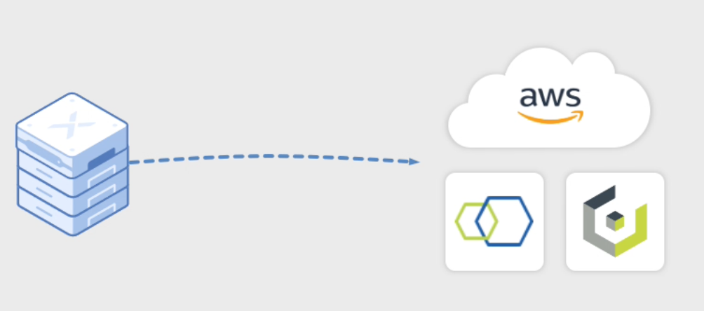

To accomplish this tiering we need the following:

-   **Source S3 Storage**
    -   Source S3 access URL
    -   Source Access key
    -   Source Secret key
-   **Destination S3 Storage**
    -   Destination S3 access URL
    -   Destination Access key
    -   Destination Secret key
-   **Networking between source and destination**
    -   Physical connectivity
    -   Firewall and security allowing for this connection

Here is an example of tiering between several Nutanix Objects sites: The
application writes to the bucket in an all-flash Nutanix Cluster Object
store and then it is tiered to a Nutanix cluster in a secondary site.

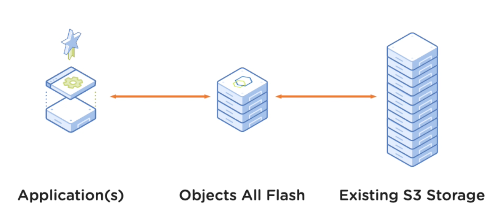

## Lab Setup

**In this lab, you will walk through a Nutanix Objects Tiering feature
to AWS S3 bucket only. The configuration procedure remains the same for
any S3 based storage tiering**.

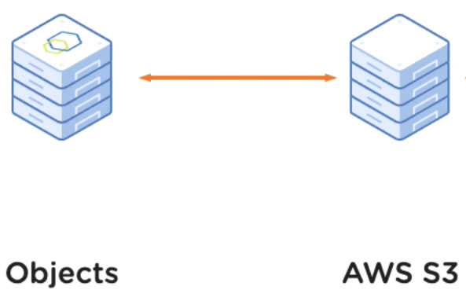

At high level we will implement the following:

-   Create AWS bucket as tiering destination
-   Setup Endpoint in Object Store configuration
-   Setup Lifecycle policies in Buckets configuration

This lab requires applications provisioned as part of the
`windows_tools_vm`{.interpreted-text role="ref"}.

**Google Chrome is recommended for this lab.**

### Creating AWS S3 Bucket as Tiering Destination

In this section you will configure AWS S3 bucket, set up access
permissions and get access and secret keys.

You can quick setup an AWS account or use your existing and do all these
activities in Free Tier program if the amount of data is less than 50
MB.

#### Create an AWS S3 Bucket

1.  Sign in to the AWS Management Console and open the Amazon S3 console
    at <https://console.aws.amazon.com/s3/>

2.  Choose **Create bucket**

3.  In Bucket name, enter your initials (**lnb** here is an example)
    **lnb-bucket** DNS-compliant name for your bucket name

    

4.  Choose your preferred region (in most cases this is automatically
    selected). Choose the closest region for tiering

5.  Choose **Block all public access**

6.  Choose to **Disable** Bucket versioning

7.  Choose to **Disable** Server-side encryption

8.  Click on **Create Bucket** button at the bottom of the page

9.  You will now see your bucket in the list

    

#### Setup Access for AWS S3 Bucket

1.  Go to your AWS IAM Management Console
    <https://console.aws.amazon.com/iamv2>

2.  Select **Users \> Add User**

3.  Enter **lnb-bucket-user** as the user name

4.  Select **Access key - Programmatic access**

5.  In the next window, select **Add user to group**

6.  Since we don\'t have group yet, click on **Create group**

    

7.  Enter **s3access** as the user group name (could be any name that is
    easy to identify)

8.  In the **Filter Policies** input type **s3** and choose
    **AmazonS3FullAccess** as the policy. This provides all permissions.
    Feel free to explore other permission policies as well.

    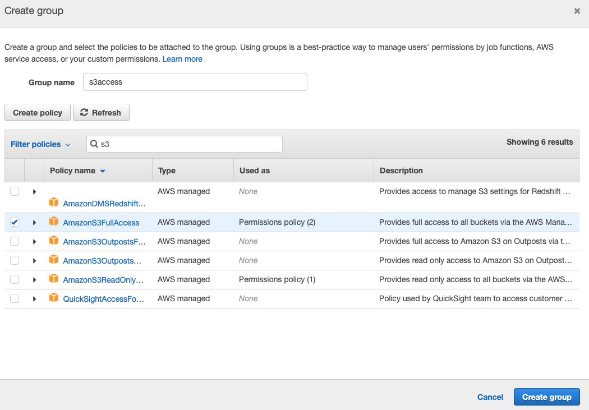

9.  Click on **Create group**

10. Choose the **s3access** as the user group name and click on **Next:
    Tags** at the bottom of the screen

    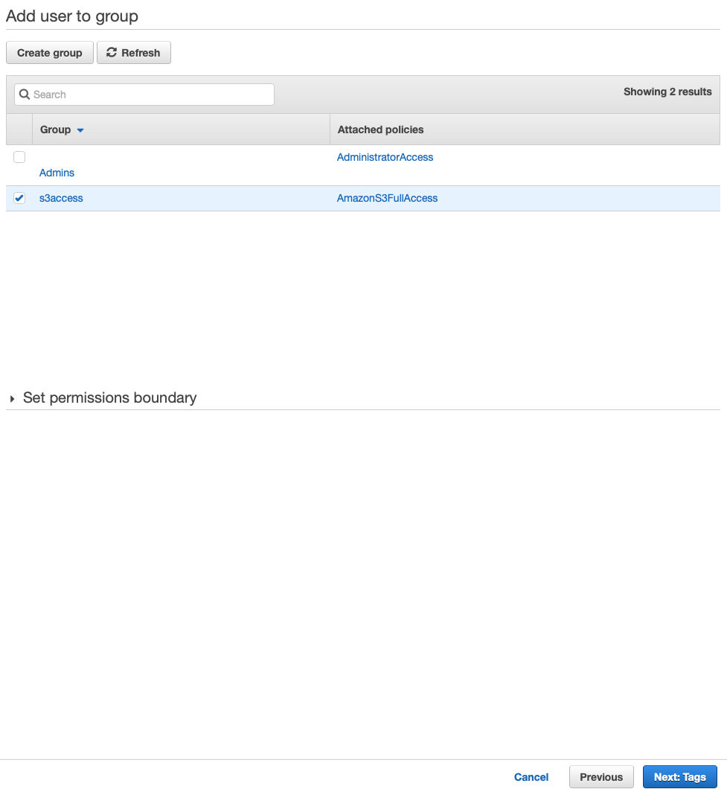

11. Click on **Next: Review**

12. Click on **Create user**

13. You will now a success message followed by download options for the
    access and secret key

14. Download access and secret key CSV file

    ::: note
    ::: title
    Note
    :::

    Make sure to download this CSV file and store it securely, as it
    will be only possible to do this once
    :::

    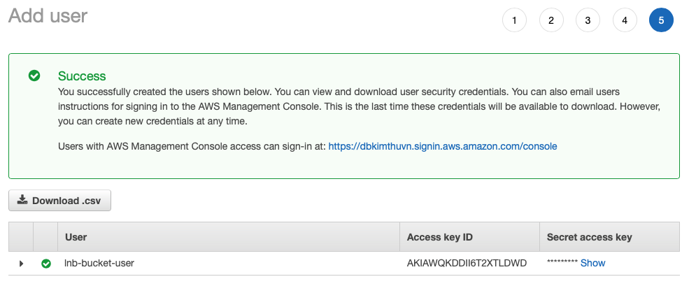

15. Click on **Close**

You have successfully setup access to your AWS S3 bucket

### Setup Endpoint in Object Store Configuration

In this section you will setup endpoints for tiering from Nutanix
Objects that you created in `objects_deploy`{.interpreted-text
role="ref"} to AWS S3.

#### Configure Endpoint

1.  Login into your Prism Central instance.

2.  In Prism Central, select `bars`{.interpreted-text role="fa"} **\>
    Services \> Objects**

3.  Choose your Objects Store

    

4.  This will open a new browser tab with additional settings for your
    chosen objects store

5.  Select **Tiering Endpoint** and click on **Create**

    If you are first person to create a tiering endpoint, click on **+
    Add**

    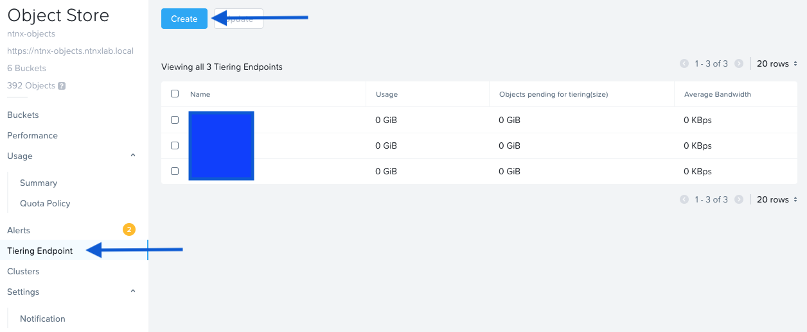

6.  In the add enpoint wizard, enter the following details

    -   Name of the Endpoint - **AWS Tiering Endpoint** (give an easily
        identifiable name)
    -   Endpoint Type - **Nutanix Objects**
    -   Service Host - **s3.ap-southeast-2.amazonaws.com** (this will
        change depending on your AWS region)
    -   Bucket Name - **lnb-bucket** (this is the name of the bucket you
        created in previous section in AWS)
    -   Access Key - **access key from CSV you downloaded** in the
        previous section
    -   Secret Key - **secret key from CSV you downloaded** in the
        previous section
    -   Skip SSL certificate validation - **Checked**

    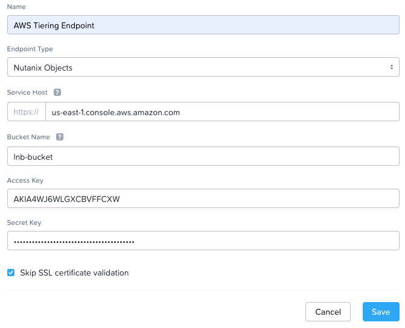

7.  Click on **Save**

8.  You will now be able to see the endpoint in your Object Store
    configuration

    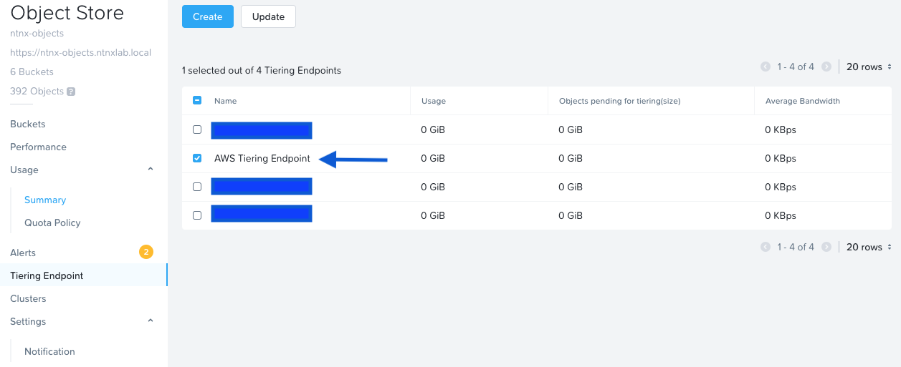

You have successfully setup a tiering endpoint which resides in AWS.

#### Configure Lifecycle Policies

Lifecycle policies allows to schedule tiering from source bucket to
target bucket irrespective of the location.

In this section we will create a lifecycle policy to tier data from
Nutanix Object\'s bucket that you created in
`objects_versioning_access_control`{.interpreted-text role="ref"} to the
AWS bucket you created earlier.

1.  In Prism Central, select `bars`{.interpreted-text role="fa"} **\>
    Services \> Objects**

2.  Choose your Objects Store

3.  Click your source bucket *your-name*-**my-bucket** (the one you
    created in here
    `objects_buckets_users_access_control`{.interpreted-text
    role="ref"})

    

4.  Click on **Lifecycle** and click on **Create Rule**

    

5.  Enter a meaningful name that you can identify, for example
    **tier-to-aws-ap-southeast-2.amazonaws.com** which specifies the
    region of tiered data

6.  Choose **All Objects**

    ::: note
    ::: title
    Note
    :::

    Note that you are also able to use **tags** as an option to select
    the objects to replicate. Make sure to explain this selection
    feature to a end-user.
    :::

    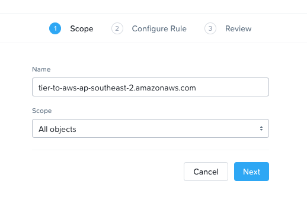

7.  Click on **Next**

8.  Select **AWS Tiering Endpoint**

9.  Set tiering to **1** days after objects creation date in the source
    bucket

10. You can select expiration to **2** days as well in the destination
    storage as an example. This is to make sure you don\'t run into a
    huge bill in the public cloud for testing purposes.

11. Click on **Add Action** and choose another expire Action

12. Choose **Multipart Uploads** and **2** days after last creation date
    on destination bucket

    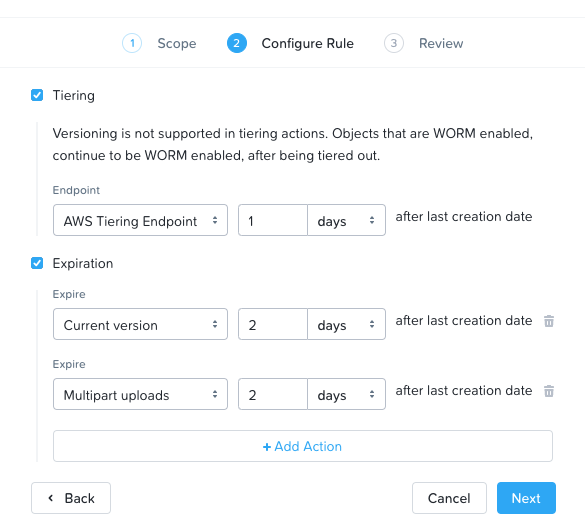

13. Click on **Next**

14. Review your configuration and click on **Done**

    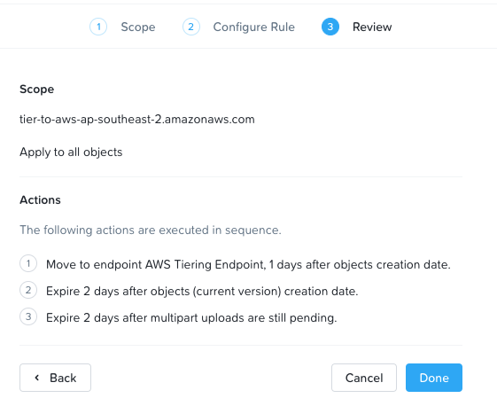

#### Verify Tiering

In this section we will verify the tiering status in the source and
destination side.

1.  Since your source bucket is already populated with data the tiering
    will start after one day

    ::: note
    ::: title
    Note
    :::

    If you are only doing Objects Tiering lab:

    1.  Create your source bucket using the procedure in *Create Bucket
        In Prism* section in
        `objects_versioning_access_control`{.interpreted-text
        role="ref"}
    2.  Populate your source bucket with objects (data) using procedure
        *Uploading Multiple Files to Buckets with Python)* in
        `objects_cli_scripts`{.interpreted-text role="ref"}
    :::

2.  Once tiering is successful, you will see Tiering status on you
    source bucket **your-name-my-bucket \> Summary**

    

3.  On the destination AWS **lnb-bucket** you will see data as follows:
    note that this may be different for your bucket.

    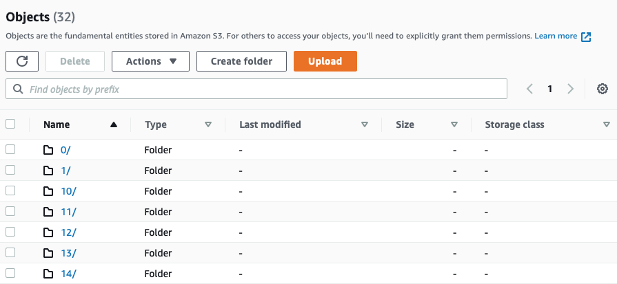

You have successfully tiered from Nutanix Object to AWS environment

## Takeaways

What are the key things you should know about **Nutanix Objects
Tiering(Lifecycle Policies)**?

-   Nutanix Objects allows easy configuration for tiering data to other
    object stores (cloud and on-premises)
-   Tiering policies needs to configured at the source (provider) of the
    bucket
    -   for example: Tiering from Nutanix Objects to AWS needs to be
        configured at Nutanix PC
    -   for example: Tiering from AWS S3 to AWS Glacier needs to be
        configured at AWS Console
-   Nutanix enables applications to store and tier data to any S3-based
    object storage without lock-in
-   Nutanix Object tiering feature groups objects together in a bigger
    data chunk to save costs on PUT request in S3
