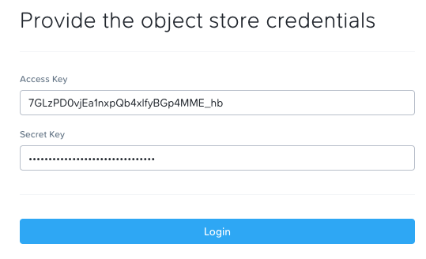

# Objects: Versioning and Access Controls {#objects_versioning_access_control}

*The estimated time to complete this lab is 60 minutes.*

## Overview

## Accessing & Creating Buckets With Objects Browser

In this exercise you will use Objects Browser to create and use buckets
in the object store using your generated access key.

### Download the Sample Images

1.  Login to *Initials***-Windows-ToolsVM** via RDP using the following
    credentials:
    -   **Username** - NTNXLAB\\Administrator
    -   **password** - nutanix/4u
2.  Use this
    [link](http://10.42.194.11/workshop_staging/peer/SampleData_Small.zip)
    to download the sample files to your Windows-ToolsVM. Once the
    download is complete, extract the contents of the .zip file.

### Use Object Browser to Create A Bucket

1.  From the Objects UI, Locate the **ntnx-objects** object store.

    

2.  The objects browser will open in a new tab

3.  Enter the following fields from the downloaded key file (while you
    created user access) and click **Login** button:

    -   **Access Key** - *Generated When User Created*
    -   **Secret Key** - *Generated When User Created*

    

4.  Click the **+ Create Bucket**.

5.  Enter the following name for your bucket, and click **Create**:

    -   **Bucket Name** - *intials*-**test-bucket**
    -   **Enable versioning** - checked

    

    ::: note
    ::: title
    Note
    :::

    Bucket names must be lower case and only contain letters, numbers,
    periods and hyphens.

    Additionally, all bucket names must be unique within a given Object
    Store. Note that if you try to create a folder with an existing
    bucket name (e.g. *your-name*-my-bucket), creation of the folder
    will not succeed.
    :::

    Creating a bucket in this fashion allows for self-service for
    entitled users, and is no different than a bucket created via the
    Prism Buckets UI.

6.  Click into your *intials*-**test-bucket** bucket, and Click the
    **+** and **Upload Objects**.

7.  Click on **Select Folder**

    

8.  Navigate to your downloads directory and find the Sample Pictures
    folder. Upload one or more pictures to your bucket.

9.  That is how easy it is to use the Objects Browser.

## Object Versioning

Object versioning allows the upload of new versions of the same object
for required changes, without losing the original data. Versioning can
be used to preserve, retrieve and restore every version of every object
stored within a bucket, allowing for easy recovery from unintended user
action and application failures.

1.  Open Notepad in *Initials***-Windows-ToolsVM**.

2.  Type "version 1.0" in Notepad, then save the file with a name (e.g.
    A.txt)

3.  In Objects Browser, upload the text file to your
    *intials*-**test-bucket** bucket.

4.  Make changes to the text file (e.g. A.txt) in Notepad and save it
    with the same name, overwriting the original file.

5.  Upload the modified file to your bucket. If desired, you can update
    and upload the file multiple times.

6.  Back in Prism Cental \> Services \> Objects, click on **Object
    Stores**.

7.  In Objects Browser of your *intials*-**test-bucket** bucket

8.  Select your **A.txt** file

9.  Under the **Actions** menu, scroll down to select **Versions**

10. You should be able to see the different versions of the file A.txt

    

## Takeaways

What are the key things you should know about **Nutanix Objects**?

-   Nutanix Objects provides a simple and scalable S3-compatible object
    storage solution, optimized for DevOps, Long Term Retention and
    Backup Target use cases.
-   Nutanix Objects can be deployed on an AHV cluster, with ESXi support
    on the roadmap.
-   Nutanix Objects will be enabled and deployed from Prism Central.
